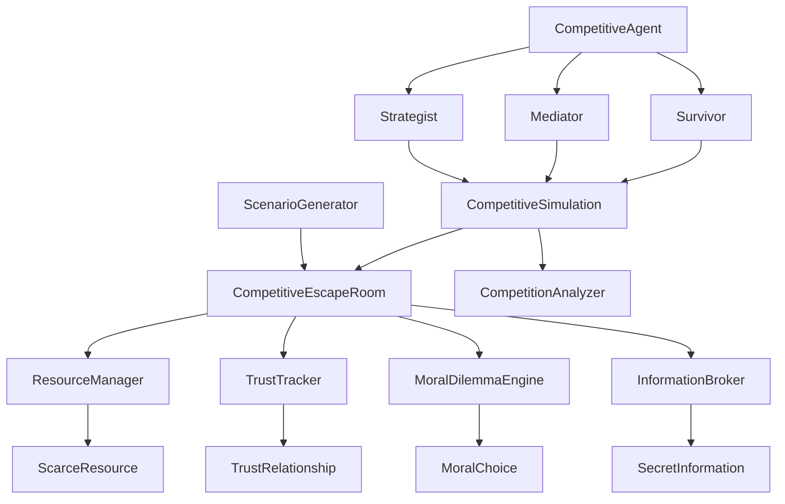

# Design Document

## Overview

This design transforms the current cooperative escape room simulation into a competitive survival scenario where three AI agents compete for a single escape opportunity. The system introduces randomization through seeded scenario generation, resource scarcity mechanics, moral dilemmas, and dynamic trust relationships that prevent predictable cooperation patterns.

The core philosophy shifts from "how can we work together to escape?" to "how can I survive when only one of us can make it out?" This creates genuine tension, strategic decision-making, and emergent behaviors that vary significantly between iterations.

## Architecture

### Core Components



### Seeded Randomization System

The `ScenarioGenerator` uses a seed-based approach to create deterministic but varied scenarios:

- **Seed Input**: Integer seed parameter that controls all random elements
- **Scenario Elements**: Puzzle type, resource distribution, moral dilemma complexity, information asymmetry
- **Reproducibility**: Same seed always generates identical scenarios for testing and analysis
- **Variation**: Different seeds create meaningfully different survival challenges

### Competition Mechanics

The system enforces zero-sum competition through several mechanisms:

- **Single Exit Rule**: Only one agent can successfully escape
- **Resource Scarcity**: Limited tools, information, and time force competition
- **Betrayal Incentives**: Actions that help survival often harm other agents
- **Trust Degradation**: Repeated interactions build or destroy relationships

## Components and Interfaces

### ScenarioGenerator

```python
class ScenarioGenerator:
    def __init__(self, seed: Optional[int] = None):
        self.seed = seed or random.randint(1, 1000000)
        self.rng = random.Random(self.seed)
    
    def generate_scenario(self) -> CompetitiveScenario:
        """Generate a complete scenario with puzzles, resources, and dilemmas"""
        
    def generate_puzzle_configuration(self) -> PuzzleConfig:
        """Create randomized puzzle elements"""
        
    def distribute_resources(self) -> Dict[str, List[Resource]]:
        """Assign scarce resources to agents"""
        
    def create_moral_dilemmas(self) -> List[MoralDilemma]:
        """Generate ethical choices that pit survival against morality"""
```

### CompetitiveEscapeRoom

```python
class CompetitiveEscapeRoom:
    def __init__(self, scenario: CompetitiveScenario):
        self.scenario = scenario
        self.resource_manager = ResourceManager(scenario.resources)
        self.trust_tracker = TrustTracker()
        self.moral_engine = MoralDilemmaEngine(scenario.dilemmas)
        self.info_broker = InformationBroker(scenario.secrets)
        self.escaped_agent = None
        self.time_remaining = scenario.time_limit
    
    def attempt_escape(self, agent_id: str, method: EscapeMethod) -> EscapeResult:
        """Process escape attempt and enforce single-survivor rule"""
        
    def process_resource_claim(self, agent_id: str, resource_id: str) -> ClaimResult:
        """Handle resource acquisition with scarcity enforcement"""
        
    def present_moral_choice(self, agent_id: str) -> MoralDilemma:
        """Offer ethical dilemma with survival implications"""
```

### ResourceManager

```python
class ResourceManager:
    def __init__(self, resources: List[ScarceResource]):
        self.resources = {r.id: r for r in resources}
        self.ownership = {}  # resource_id -> agent_id
        self.usage_history = []
    
    def claim_resource(self, agent_id: str, resource_id: str) -> bool:
        """Attempt to claim a scarce resource"""
        
    def transfer_resource(self, from_agent: str, to_agent: str, resource_id: str) -> bool:
        """Handle resource trading between agents"""
        
    def get_available_resources(self, agent_id: str) -> List[ScarceResource]:
        """Return resources accessible to specific agent"""
```

### TrustTracker

```python
class TrustTracker:
    def __init__(self):
        self.trust_matrix = {}  # (agent1, agent2) -> trust_level
        self.betrayal_history = []
        self.cooperation_history = []
    
    def update_trust(self, actor: str, target: str, action: TrustAction):
        """Modify trust based on cooperative or betrayal actions"""
        
    def get_trust_level(self, agent1: str, agent2: str) -> float:
        """Return current trust level between two agents"""
        
    def calculate_reputation(self, agent_id: str) -> float:
        """Compute overall reputation based on all relationships"""
```

### MoralDilemmaEngine

```python
class MoralDilemmaEngine:
    def __init__(self, dilemmas: List[MoralDilemma]):
        self.dilemmas = dilemmas
        self.choices_made = {}
        self.ethical_scores = {}
    
    def present_dilemma(self, agent_id: str, context: Dict) -> MoralDilemma:
        """Offer context-appropriate moral choice"""
        
    def process_choice(self, agent_id: str, choice: MoralChoice) -> ChoiceConsequences:
        """Apply consequences of ethical decision"""
        
    def calculate_ethical_burden(self, agent_id: str) -> float:
        """Compute cumulative moral weight of agent's choices"""
```

### InformationBroker

```python
class InformationBroker:
    def __init__(self, secrets: List[SecretInformation]):
        self.secrets = {s.id: s for s in secrets}
        self.agent_knowledge = {}  # agent_id -> set of known secret_ids
        self.sharing_history = []
    
    def reveal_secret(self, agent_id: str, secret_id: str):
        """Grant agent access to specific information"""
        
    def share_information(self, from_agent: str, to_agent: str, secret_id: str) -> bool:
        """Handle information sharing between agents"""
        
    def get_agent_knowledge(self, agent_id: str) -> List[SecretInformation]:
        """Return all information known to specific agent"""
```

## Data Models

### Core Data Structures

```python
@dataclass
class CompetitiveScenario:
    seed: int
    puzzle_config: PuzzleConfig
    resources: List[ScarceResource]
    moral_dilemmas: List[MoralDilemma]
    secret_information: List[SecretInformation]
    time_limit: int
    escape_methods: List[EscapeMethod]

@dataclass
class ScarceResource:
    id: str
    name: str
    description: str
    required_for: List[str]  # escape methods that need this resource
    exclusivity: bool  # can only be used by one agent
    usage_cost: int  # time or other cost to use

@dataclass
class MoralDilemma:
    id: str
    description: str
    selfish_choice: MoralChoice
    altruistic_choice: MoralChoice
    context_requirements: Dict[str, Any]

@dataclass
class MoralChoice:
    description: str
    survival_benefit: float
    ethical_cost: float
    trust_impact: Dict[str, float]  # impact on relationships
    consequences: List[str]

@dataclass
class SecretInformation:
    id: str
    content: str
    value: float  # how useful for escape
    sharing_risk: float  # danger of revealing to others
    required_for: List[str]  # escape methods needing this info

@dataclass
class TrustRelationship:
    agent1: str
    agent2: str
    trust_level: float  # -1.0 to 1.0
    betrayal_count: int
    cooperation_count: int
    last_interaction: datetime
```

### Agent State Extensions

```python
@dataclass
class CompetitiveAgentState:
    agent_id: str
    resources_owned: List[str]
    secrets_known: List[str]
    trust_relationships: Dict[str, float]
    moral_choices_made: List[MoralChoice]
    ethical_burden: float
    survival_probability: float
    desperation_level: float  # increases with time pressure
```

## Error Handling

### Competition Integrity

- **Double Escape Prevention**: Strict validation that only one agent can escape
- **Resource Conflict Resolution**: Clear rules for simultaneous resource claims
- **Trust Calculation Errors**: Fallback to neutral trust levels on calculation failures
- **Seed Validation**: Ensure reproducible scenario generation

### Agent Behavior Validation

- **Personality Consistency**: Validate that agent choices align with their core traits
- **Information Leakage**: Prevent agents from accessing information they shouldn't know
- **Action Validation**: Ensure agents can only perform actions with available resources
- **Time Limit Enforcement**: Hard stops when time expires

### Simulation Stability

- **Deadlock Detection**: Identify and resolve situations where no progress is possible
- **Infinite Loop Prevention**: Timeout mechanisms for agent decision-making
- **Memory Management**: Efficient handling of growing trust and choice histories
- **Graceful Degradation**: Continue simulation even if some components fail

## Testing Strategy

### Unit Testing

- **ScenarioGenerator**: Test seed reproducibility and variation
- **ResourceManager**: Verify scarcity enforcement and ownership tracking
- **TrustTracker**: Validate trust calculations and relationship dynamics
- **MoralDilemmaEngine**: Test choice consequences and ethical scoring
- **InformationBroker**: Verify information asymmetry and sharing mechanics

### Integration Testing

- **Competition Flow**: End-to-end scenarios with different outcomes
- **Agent Interactions**: Multi-agent resource conflicts and negotiations
- **Moral Choice Cascades**: How ethical decisions affect subsequent options
- **Trust Evolution**: Long-term relationship changes over multiple interactions

### Scenario Testing

- **Seed Reproducibility**: Same seed produces identical results
- **Outcome Variation**: Different seeds create meaningfully different scenarios
- **Balance Testing**: Ensure no single strategy dominates all scenarios
- **Personality Expression**: Verify agents behave according to their traits under pressure

### Performance Testing

- **Simulation Speed**: Measure time for complete competitive scenarios
- **Memory Usage**: Track resource consumption during long simulations
- **Scalability**: Test with different numbers of agents and complexity levels
- **Stress Testing**: High-pressure scenarios with maximum time constraints

### Behavioral Analysis

- **Strategy Emergence**: Document new survival strategies that develop
- **Cooperation Patterns**: Analyze when and why agents choose to cooperate
- **Betrayal Triggers**: Identify conditions that lead to betrayal
- **Personality Consistency**: Verify agents maintain character under extreme pressure