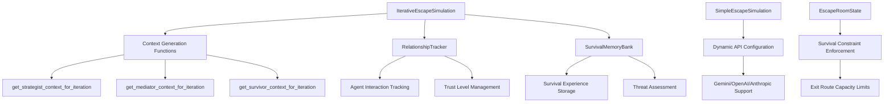

# Design Document

## Overview

This design addresses critical implementation gaps in the CrewAI Escape Room Simulation that prevent execution. The system currently has missing function implementations, incomplete class definitions, and configuration issues causing runtime failures. The design provides a comprehensive solution to implement all missing components while maintaining compatibility with the existing architecture.

The core issue is that the `iterative_engine.py` calls functions and classes that don't exist, causing NameError and AttributeError exceptions. Additionally, the API configuration is hardcoded to OpenAI, limiting flexibility, and the survival constraint isn't properly enforced.

## Architecture

### Current System Architecture
The system follows a layered architecture:
- **Simulation Layer**: `SimpleEscapeSimulation` and `IterativeEscapeSimulation` classes
- **Agent Layer**: Strategist, Mediator, and Survivor agents with memory capabilities
- **Task Layer**: Assessment, planning, and execution task generators
- **Memory Layer**: `IterativeMemoryManager` for cross-iteration learning
- **Room Layer**: `EscapeRoomState` for environment management

### Missing Components Integration
The missing components will integrate into the existing architecture as follows:



## Components and Interfaces

### 1. Context Generation Functions

**Location**: `src/escape_room_sim/simulation/iterative_engine.py`

These functions generate iteration-specific context for each agent type:

```python
def get_strategist_context_for_iteration(
    iteration_num: int, 
    previous_failures: List[str], 
    current_resources: Dict[str, Any]
) -> str

def get_mediator_context_for_iteration(
    iteration_num: int, 
    relationship_tracker: 'RelationshipTracker', 
    team_stress_level: float, 
    previous_conflicts: List[str]
) -> str

def get_survivor_context_for_iteration(
    iteration_num: int, 
    survival_memory: 'SurvivalMemoryBank', 
    current_threat_level: float, 
    resource_status: Dict[str, Any]
) -> str
```

**Design Decisions**:
- Functions return formatted strings for direct use in task descriptions
- Context includes iteration-specific information and historical data
- Each function is specialized for its agent's role and priorities
- Context length is controlled to prevent token overflow

### 2. RelationshipTracker Class

**Location**: `src/escape_room_sim/simulation/relationship_tracker.py` (new file)

**Core Interface**:
```python
class RelationshipTracker:
    def __init__(self)
    def record_interaction(agent_a: str, agent_b: str, interaction_type: str, ...)
    def record_successful_collaboration(agents: List[str], strategy: str, outcome: str)
    def record_conflict(agent_a: str, agent_b: str, conflict_reason: str, resolution: str)
    def get_trust_level(agent_a: str, agent_b: str) -> float
    def get_team_cohesion(agents: List[str]) -> float
    def get_summary() -> str
    def export_data() -> Dict
```

**Design Decisions**:
- Uses alphabetical ordering for relationship keys to ensure consistency
- Trust levels range from 0.0 to 1.0 with 0.5 as neutral starting point
- Tracks both positive (collaboration) and negative (conflict) interactions
- Provides summary methods for easy integration with context generation
- Supports data export for persistence and analysis

### 3. SurvivalMemoryBank Class

**Location**: `src/escape_room_sim/simulation/survival_memory.py` (new file)

**Core Interface**:
```python
class SurvivalMemoryBank:
    def __init__(self)
    def record_close_call(situation: str, threat: str, survival_action: str, ...)
    def record_successful_strategy(situation: str, strategy: str, outcome: str, ...)
    def assess_current_threat(threat_type: str, current_situation: Dict) -> ThreatAssessment
    def get_relevant_experiences(max_count: int) -> str
    def calculate_survival_probability(current_situation: Dict, proposed_action: str) -> float
    def export_data() -> Dict
```

**Design Decisions**:
- Stores experiences with importance scores for prioritized retrieval
- Maintains survival principles that evolve based on experience
- Provides threat assessment based on historical patterns
- Calculates survival probabilities using historical success rates
- Supports both close calls (high importance) and successful strategies

### 4. Dynamic API Configuration

**Location**: `src/escape_room_sim/simulation/simple_engine.py`

**Interface**:
```python
def _get_memory_config(self) -> Dict[str, Any]:
    # Returns configuration based on available API keys
    # Priority: Gemini -> OpenAI -> Anthropic -> Error

def _create_crew(self, agents: List[Agent], tasks: List[Task]) -> Crew:
    # Uses dynamic configuration for memory setup
```

**Design Decisions**:
- Checks environment variables in priority order
- Gemini preferred for consistency with agent LLM configuration
- OpenAI as fallback with embedding support
- Anthropic fallback uses local embeddings (no API embedding support)
- Clear error messages when no valid configuration found

### 5. Survival Constraint Enforcement

**Location**: `src/escape_room_sim/room/escape_room_state.py`

**Interface**:
```python
def evaluate_survival_scenarios(self, agents: List[str]) -> Dict[str, Any]:
    # Returns all possible 2-agent survival combinations

def _calculate_escape_probability(self, exit_name: str, agents: List[str]) -> float:
    # Calculates success probability for specific exit route

def _calculate_moral_difficulty(self, sacrifice: str, survivors: List[str]) -> float:
    # Calculates moral difficulty of sacrifice decisions
```

**Design Decisions**:
- Enforces "only two can survive" by limiting exit capacities
- Main door capacity reduced from 3 to 2 agents
- Generates all possible survival scenarios with moral difficulty scores
- Considers stress level and time pressure in moral calculations
- Returns scenarios sorted by success probability

## Data Models

### RelationshipEntry
```python
@dataclass
class RelationshipEntry:
    agent_a: str
    agent_b: str
    interaction_type: str  # "collaboration", "conflict", "support", "disagreement"
    context: str
    outcome: str  # "positive", "negative", "neutral"
    trust_impact: float  # -1.0 to 1.0
    timestamp: datetime
```

### AgentRelationship
```python
@dataclass
class AgentRelationship:
    agent_a: str
    agent_b: str
    trust_level: float = 0.5  # 0.0 to 1.0
    collaboration_count: int = 0
    conflict_count: int = 0
    last_interaction: Optional[datetime] = None
    interaction_history: List[RelationshipEntry]
```

### SurvivalExperience
```python
@dataclass
class SurvivalExperience:
    situation_type: str  # "resource_shortage", "time_pressure", "team_conflict", "escape_attempt"
    threat_level: float  # 0.0 to 1.0
    survival_action: str
    outcome: str  # "success", "failure", "partial_success"
    lessons_learned: List[str]
    agents_involved: List[str]
    resources_used: List[str]
    timestamp: datetime
    importance_score: float = 0.5  # 0.0 to 1.0
```

### ThreatAssessment
```python
@dataclass
class ThreatAssessment:
    threat_type: str
    severity: float  # 0.0 to 1.0
    probability: float  # 0.0 to 1.0
    mitigation_strategies: List[str]
    resource_requirements: List[str]
```

## Error Handling

### Function Call Safety
- All context generation functions include parameter validation
- Default values provided for missing or None parameters
- Graceful degradation when memory systems are unavailable
- Clear error messages for debugging

### API Configuration Resilience
- Multiple fallback options for different API providers
- Environment variable validation with helpful error messages
- Graceful handling of missing API keys
- Memory system continues to function with local embeddings when needed

### Simulation Safety Measures
- Maximum execution time limits (30 minutes total)
- Stagnation detection (5 iterations without progress)
- Progress hashing to detect infinite loops
- Exception handling with graceful termination and reporting

### Data Persistence Safety
- File operation error handling
- Backup creation before overwriting data
- Validation of loaded data structures
- Recovery from corrupted memory files

## Testing Strategy

### Unit Testing Approach
1. **Context Generation Functions**
   - Test with various input combinations
   - Verify output format and content
   - Test edge cases (empty lists, None values)
   - Validate string formatting and length

2. **RelationshipTracker Class**
   - Test relationship creation and updates
   - Verify trust level calculations
   - Test interaction recording and retrieval
   - Validate team cohesion calculations

3. **SurvivalMemoryBank Class**
   - Test experience recording and retrieval
   - Verify threat assessment calculations
   - Test survival probability calculations
   - Validate importance scoring

4. **API Configuration**
   - Test with different environment variable combinations
   - Verify fallback behavior
   - Test error handling for missing keys
   - Validate memory configuration generation

5. **Survival Constraints**
   - Test exit capacity enforcement
   - Verify scenario generation
   - Test probability calculations
   - Validate moral difficulty scoring

### Integration Testing Approach
1. **Full Simulation Execution**
   - Test complete simulation runs without crashes
   - Verify memory systems work together
   - Test API configuration with different providers
   - Validate survival constraint enforcement

2. **Cross-Component Communication**
   - Test data flow between components
   - Verify context generation uses correct data sources
   - Test memory persistence and loading
   - Validate error propagation and handling

3. **Performance Testing**
   - Test simulation completion within time limits
   - Verify memory usage remains reasonable
   - Test with maximum iteration counts
   - Validate stagnation detection

### Test Data Requirements
- Sample iteration results for memory testing
- Mock API responses for configuration testing
- Predefined agent interactions for relationship testing
- Various survival scenarios for constraint testing

## Implementation Considerations

### Backward Compatibility
- All new components integrate with existing interfaces
- No breaking changes to current agent or task implementations
- Existing memory manager continues to work alongside new components
- Current simulation configurations remain valid

### Performance Optimization
- Context generation functions are lightweight and fast
- Memory systems use efficient data structures
- Relationship tracking uses minimal storage
- Survival memory prioritizes important experiences

### Extensibility
- New interaction types can be added to RelationshipTracker
- Additional survival experience types supported
- API configuration easily extended for new providers
- Exit route system supports additional constraint types

### Configuration Management
- Environment variables control all external dependencies
- Default values provided for all optional parameters
- Configuration validation with clear error messages
- Support for different deployment environments

This design ensures all critical gaps are addressed while maintaining system integrity and providing a foundation for future enhancements.