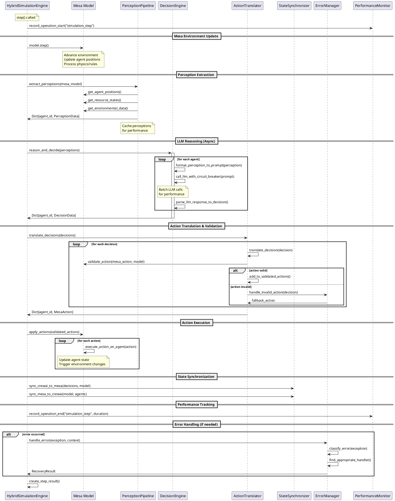
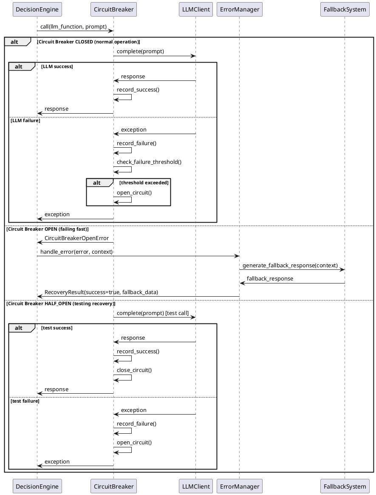
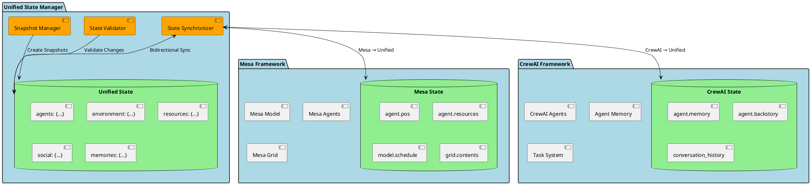
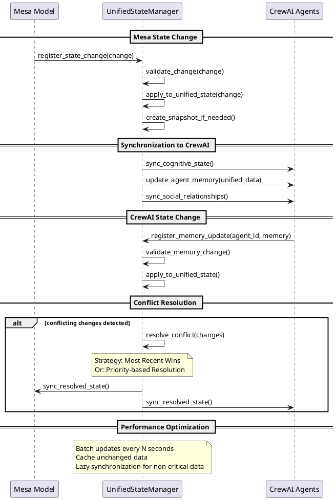
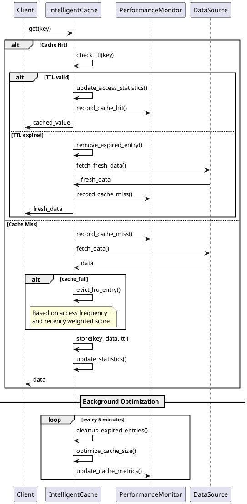
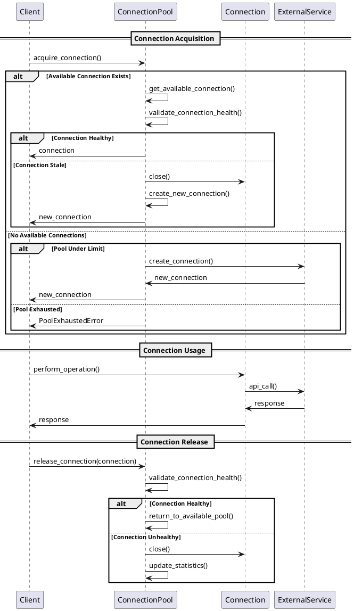

# Mesa-CrewAI Hybrid Architecture: Data Flow and Sequence Diagrams

## Overview

This document provides detailed data flow and sequence diagrams for the Mesa-CrewAI hybrid architecture, showing exactly how data flows through the system and how the frameworks interact step-by-step.

## 1. Complete Data Flow Diagram

### Perception → Reasoning → Action Pipeline

```
┌─────────────────────────────────────────────────────────────────────────────────┐
│                           MESA-CREWAI HYBRID DATA FLOW                         │
└─────────────────────────────────────────────────────────────────────────────────┘

┌──────────────┐    ┌─────────────────┐    ┌──────────────────┐    ┌─────────────┐
│   Mesa       │    │   Perception    │    │    CrewAI        │    │   Mesa      │
│ Environment  │    │   Pipeline      │    │   Reasoning      │    │  Actions    │
│              │    │                 │    │                  │    │             │
│ ┌──────────┐ │    │ ┌─────────────┐ │    │ ┌──────────────┐ │    │ ┌─────────┐ │
│ │Agents    │ │────▶│ │Extract      │ │────▶│ │LLM Prompt    │ │────▶│ │Execute  │ │
│ │Positions │ │    │ │Spatial Data │ │    │ │Generation    │ │    │ │Mesa     │ │
│ └──────────┘ │    │ └─────────────┘ │    │ └──────────────┘ │    │ │Actions  │ │
│              │    │                 │    │                  │    │ └─────────┘ │
│ ┌──────────┐ │    │ ┌─────────────┐ │    │ ┌──────────────┐ │    │             │
│ │Resources │ │────▶│ │Extract      │ │────▶│ │Agent Memory  │ │    │ ┌─────────┐ │
│ │Available │ │    │ │Resource     │ │    │ │Integration   │ │    │ │Update   │ │
│ └──────────┘ │    │ │Data         │ │    │ └──────────────┘ │    │ │State    │ │
│              │    │ └─────────────┘ │    │                  │    │ └─────────┘ │
│ ┌──────────┐ │    │                 │    │ ┌──────────────┐ │    │             │
│ │Social    │ │────▶│ ┌─────────────┐ │────▶│ │Decision      │ │    └─────────────┘
│ │Relations │ │    │ │Extract      │ │    │ │Generation    │ │           │
│ └──────────┘ │    │ │Social Data  │ │    │ └──────────────┘ │           │
│              │    │ └─────────────┘ │    │                  │           │
│ ┌──────────┐ │    │                 │    │ ┌──────────────┐ │           │
│ │Hazards/  │ │────▶│ ┌─────────────┐ │────▶│ │Action        │ │           │
│ │Threats   │ │    │ │Extract      │ │    │ │Translation   │ │           │
│ └──────────┘ │    │ │Environmental│ │    │ └──────────────┘ │           │
│              │    │ │Data         │ │    │                  │           │
└──────────────┘    │ └─────────────┘ │    └──────────────────┘           │
                    │                 │                                   │
                    │ ┌─────────────┐ │    ┌──────────────────┐           │
                    │ │Natural      │ │────▶│    Unified       │◀──────────┘
                    │ │Language     │ │    │  State Manager   │
                    │ │Formatting   │ │    │                  │
                    │ └─────────────┘ │    │ ┌──────────────┐ │
                    └─────────────────┘    │ │State Sync   │ │
                                          │ │& Validation │ │
                                          │ └──────────────┘ │
                                          └──────────────────┘
```

### Key Data Transformations:

1. **Mesa State → PerceptionData**
   ```
   Mesa Agent Position (x, y) → SpatialPerception {
     current_position: (x, y),
     visible_area: [(x±range, y±range)],
     movement_options: [valid_positions],
     obstacles: [blocked_positions]
   }
   ```

2. **PerceptionData → Natural Language**
   ```
   SpatialPerception → "You are at position (5, 3). You can move north, east, 
   or south. There are obstacles blocking the west path."
   ```

3. **CrewAI Decision → MesaAction**
   ```
   DecisionData {
     chosen_action: "move_north",
     parameters: {target: (5, 4)}
   } → MesaAction {
     action_type: "move",
     parameters: {target_position: (5, 4)}
   }
   ```

## 2. Simulation Step Execution Sequence

### Main Simulation Loop



### Timing Breakdown:
- Mesa step: ~10-50ms
- Perception extraction: ~5-20ms  
- LLM reasoning: ~500-3000ms (batched)
- Action translation: ~1-5ms
- State synchronization: ~5-15ms
- **Total: ~520-3090ms per step**

## 3. Error Handling and Recovery Sequence

### Circuit Breaker Pattern for LLM Failures



### Error Recovery Strategies:

1. **LLM Failure Recovery**:
   ```
   LLM API Error → Circuit Breaker → Fallback Response Generator
   ├── Personality-based responses
   ├── Rule-based decision making  
   └── Previous successful responses cache
   ```

2. **Mesa Failure Recovery**:
   ```
   Mesa Position Error → State Validator → Position Reset
   Mesa Bounds Error → Boundary Checker → Safe Position Assignment
   ```

3. **State Sync Failure Recovery**:
   ```
   Sync Conflict → State Validator → Rollback to Last Valid State
   Data Corruption → State Serializer → Restore from Snapshot
   ```

## 4. State Management and Synchronization

### Unified State Structure



### State Synchronization Flow:



## 5. Performance Monitoring and Caching

### Intelligent Caching Flow



### Performance Monitoring Data Flow:

```
┌─────────────────┐    ┌──────────────────┐    ┌────────────────┐
│   Operation     │────▶│  Performance    │────▶│  Optimization │
│   Execution     │    │   Monitoring    │    │   Engine      │
│                 │    │                 │    │               │
│ ┌─────────────┐ │    │ ┌─────────────┐ │    │ ┌───────────┐ │
│ │LLM Call     │ │────▶│ │Record       │ │────▶│ │Batch LLM │ │
│ │Duration     │ │    │ │Latency      │ │    │ │Calls      │ │
│ └─────────────┘ │    │ └─────────────┘ │    │ └───────────┘ │
│                 │    │                 │    │               │
│ ┌─────────────┐ │    │ ┌─────────────┐ │    │ ┌───────────┐ │
│ │Memory Usage │ │────▶│ │Track        │ │────▶│ │Enable     │ │
│ │Metrics      │ │    │ │Resource     │ │    │ │Caching    │ │
│ └─────────────┘ │    │ │Usage        │ │    │ └───────────┘ │
│                 │    │ └─────────────┘ │    │               │
│ ┌─────────────┐ │    │                 │    │ ┌───────────┐ │
│ │Error Rate   │ │────▶│ ┌─────────────┐ │────▶│ │Circuit    │ │
│ │Tracking     │ │    │ │Calculate    │ │    │ │Breaker    │ │
│ └─────────────┘ │    │ │Error Rate   │ │    │ │Activation │ │
└─────────────────┘    │ └─────────────┘ │    │ └───────────┘ │
                       │                 │    │               │
                       │ ┌─────────────┐ │    │ ┌───────────┐ │
                       │ │Performance  │ │────▶│ │Connection │ │
                       │ │Profile      │ │    │ │Pool       │ │
                       │ │Generation   │ │    │ │Management │ │
                       │ └─────────────┘ │    │ └───────────┘ │
                       └──────────────────┘    └────────────────┘
```

## 6. Async Processing and Batching

### LLM Batch Processing Sequence

```plantuml
@startuml
participant "Agent1" as A1
participant "Agent2" as A2  
participant "Agent3" as A3
participant "LLMBatchProcessor" as Batch
participant "LLMClient" as LLM

== Request Collection Phase ==
A1 -> Batch: add_request(prompt1)
note over Batch: Start batch timer
A2 -> Batch: add_request(prompt2)
A3 -> Batch: add_request(prompt3)

alt Batch Size Reached OR Timeout
    note over Batch: Trigger batch processing
    
    == Batch Processing Phase ==
    Batch -> Batch: collect_current_batch()
    Batch -> LLM: batch_complete([prompt1, prompt2, prompt3])
    
    alt LLM Batch Support Available
        LLM -> LLM: process_batch_efficiently()
        LLM -> Batch: [response1, response2, response3]
    else No Batch Support
        par
            LLM -> LLM: complete(prompt1)
        and
            LLM -> LLM: complete(prompt2)  
        and
            LLM -> LLM: complete(prompt3)
        end
        LLM -> Batch: [response1, response2, response3]
    end
    
    == Response Distribution ==
    Batch -> A1: response1
    Batch -> A2: response2
    Batch -> A3: response3
    
    note over Batch: Update batch statistics\nStart new batch timer
end
@enduml
```

### Connection Pool Management



## 7. Integration Points and Data Handoffs

### Key Integration Points:

1. **Mesa → Perception Pipeline**
   ```python
   # Data transformation point
   mesa_agent.pos → PerceptionData.spatial_data['current_position']
   mesa_model.resources → PerceptionData.resources['available_resources']
   ```

2. **Perception → CrewAI Prompt**
   ```python
   # Natural language formatting
   PerceptionData → "You are at position (5,3). Resources nearby: key, tool."
   ```

3. **CrewAI Response → Mesa Action**
   ```python
   # Decision parsing and translation
   "I want to move north" → MesaAction(type="move", params={'direction': 'north'})
   ```

4. **State Synchronization Points**
   ```python
   # Bidirectional sync
   unified_state.agents[id].position ↔ mesa_agent.pos
   unified_state.memories[id] ↔ crewai_agent.memory
   ```

### Performance Considerations:

- **LLM Latency**: 500-3000ms per call (mitigated by batching)
- **Perception Extraction**: ~20ms (cached for performance)
- **State Synchronization**: ~15ms (batched updates)
- **Memory Operations**: ~10ms (intelligent caching)

### Error Recovery Pathways:

1. **LLM Failures** → Circuit Breaker → Fallback Responses
2. **Mesa Errors** → State Validation → Position/State Reset  
3. **Sync Conflicts** → Conflict Resolution → State Rollback
4. **Performance Degradation** → Auto-optimization → Caching/Batching

This architecture provides a robust, performant hybrid system that gracefully handles the integration challenges between Mesa's spatial simulation and CrewAI's LLM-powered reasoning capabilities.