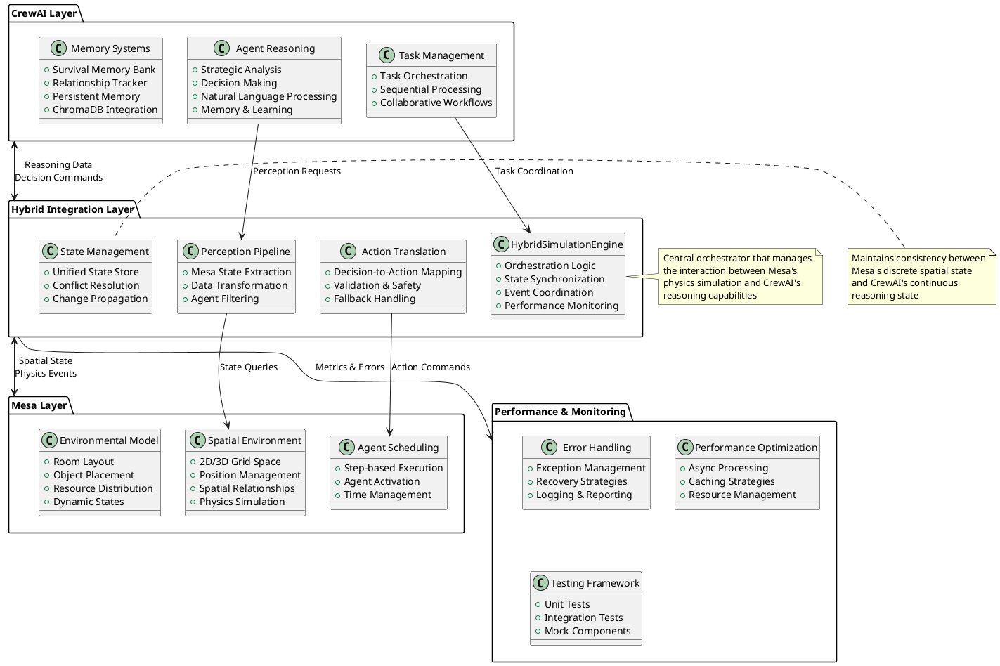
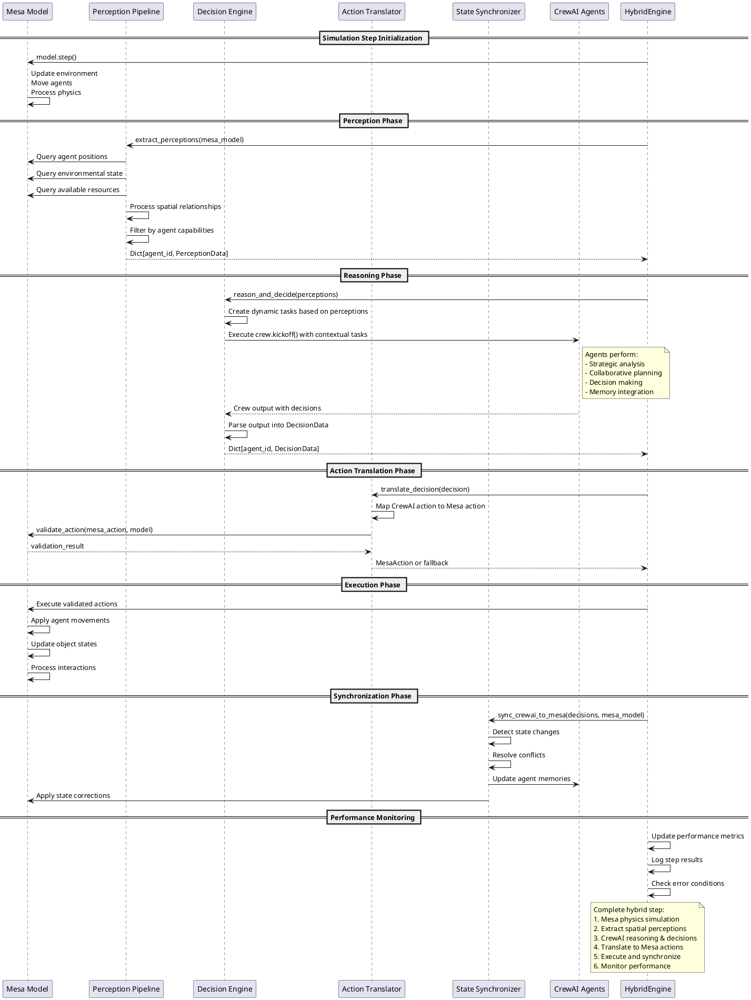

# Mesa-CrewAI Hybrid Architecture Design

## 1. System Overview Diagram



## 2. Component Architecture Diagram

```plantuml
@startuml Mesa-CrewAI-Component-Architecture

interface IPerceptionPipeline {
  +extract_perceptions(mesa_model): Dict[str, PerceptionData]
  +filter_perceptions(perceptions, agent_id): PerceptionData
}

interface IDecisionEngine {
  +reason_and_decide(perceptions): Dict[str, DecisionData]
  +update_agent_memory(agent_id, experience): void
}

interface IActionTranslator {
  +translate_decision(decision): MesaAction
  +validate_action(action, mesa_model): bool
}

interface IStateSynchronizer {
  +sync_mesa_to_crewai(mesa_model): void
  +sync_crewai_to_mesa(decisions, mesa_model): void
}

class HybridAgent {
  -agent_id: str
  -mesa_agent: mesa.Agent
  -crewai_agent: crewai.Agent
  -state: ComponentState
  -last_perception: PerceptionData
  -last_decision: DecisionData
  -performance_metrics: Dict[str, float]
  
  +get_unified_state(): Dict[str, Any]
  +update_performance_metrics(metrics): void
}

class HybridSimulationEngine {
  -mesa_model: mesa.Model
  -crewai_agents: List[Agent]
  -hybrid_agents: Dict[str, HybridAgent]
  -state: ComponentState
  -step_count: int
  -performance_history: List[Dict]
  
  +initialize(): void
  +step(): Dict[str, Any]
  +get_simulation_state(): Dict[str, Any]
}

class PerceptionData {
  +agent_id: str
  +timestamp: datetime
  +spatial_data: Dict[str, Any]
  +environmental_state: Dict[str, Any]
  +nearby_agents: List[str]
  +available_actions: List[str]
  +resources: Dict[str, Any]
  +constraints: Dict[str, Any]
}

class DecisionData {
  +agent_id: str
  +timestamp: datetime
  +chosen_action: str
  +action_parameters: Dict[str, Any]
  +reasoning: str
  +confidence_level: float
  +fallback_actions: List[str]
}

class MesaAction {
  +agent_id: str
  +action_type: str
  +parameters: Dict[str, Any]
  +expected_duration: float
  +prerequisites: List[str]
}

' Concrete Implementations
class EscapeRoomPerceptionPipeline implements IPerceptionPipeline {
  -room_analyzer: RoomAnalyzer
  -spatial_processor: SpatialProcessor
  -constraint_detector: ConstraintDetector
  
  +extract_perceptions(mesa_model): Dict[str, PerceptionData]
  +filter_perceptions(perceptions, agent_id): PerceptionData
  +analyze_room_state(mesa_model): RoomState
  +detect_nearby_objects(position, radius): List[Object]
}

class CrewAIDecisionEngine implements IDecisionEngine {
  -crew: Crew
  -task_factory: TaskFactory
  -memory_manager: MemoryManager
  
  +reason_and_decide(perceptions): Dict[str, DecisionData]
  +update_agent_memory(agent_id, experience): void
  +create_dynamic_tasks(perceptions): List[Task]
  +process_crew_output(output): Dict[str, DecisionData]
}

class EscapeRoomActionTranslator implements IActionTranslator {
  -action_mappings: Dict[str, ActionMapping]
  -validator: ActionValidator
  
  +translate_decision(decision): MesaAction
  +validate_action(action, mesa_model): bool
  +map_crewai_to_mesa(action_name): str
  +check_prerequisites(action, state): bool
}

class UnifiedStateSynchronizer implements IStateSynchronizer {
  -state_store: UnifiedStateStore
  -change_detector: ChangeDetector
  -conflict_resolver: ConflictResolver
  
  +sync_mesa_to_crewai(mesa_model): void
  +sync_crewai_to_mesa(decisions, mesa_model): void
  +detect_state_changes(): List[StateChange]
  +resolve_conflicts(changes): List[ResolvedChange]
}

' Relationships
HybridSimulationEngine *-- HybridAgent : "manages"
HybridSimulationEngine o-- IPerceptionPipeline : "uses"
HybridSimulationEngine o-- IDecisionEngine : "uses"
HybridSimulationEngine o-- IActionTranslator : "uses"
HybridSimulationEngine o-- IStateSynchronizer : "uses"

HybridAgent *-- PerceptionData : "receives"
HybridAgent *-- DecisionData : "produces"

IPerceptionPipeline --> PerceptionData : "creates"
IDecisionEngine --> DecisionData : "creates"
IActionTranslator --> MesaAction : "creates"

EscapeRoomPerceptionPipeline ..|> IPerceptionPipeline
CrewAIDecisionEngine ..|> IDecisionEngine
EscapeRoomActionTranslator ..|> IActionTranslator
UnifiedStateSynchronizer ..|> IStateSynchronizer

@enduml
```



## 3. Integration Architecture Diagram



## 4. Technology Stack & Interface Specifications

### Core Dependencies
```python
# Mesa Framework
mesa>=2.0.0          # Agent-based modeling platform
networkx>=3.0        # Graph algorithms for spatial analysis

# CrewAI Framework  
crewai>=0.15.0       # Multi-agent LLM framework
langchain-community>=0.0.21  # LangChain integrations

# Integration Layer
asyncio              # Async processing for performance
dataclasses          # Structured data representation
pydantic>=2.11.0     # Data validation and serialization

# Performance & Monitoring
pytest>=8.0.0        # Testing framework
numpy>=1.26.0        # Numerical operations
chromadb             # Vector database for memory
```

### Key Interface Specifications

#### 1. PerceptionData Structure
```python
@dataclass
class PerceptionData:
    """Structured perception data from Mesa environment"""
    agent_id: str
    timestamp: datetime
    spatial_data: Dict[str, Any]        # Position, orientation, nearby objects
    environmental_state: Dict[str, Any]  # Room conditions, physics state
    nearby_agents: List[str]            # Other agents in perception range
    available_actions: List[str]        # Valid actions in current state
    resources: Dict[str, Any]           # Accessible resources
    constraints: Dict[str, Any]         # Movement/action limitations
```

#### 2. DecisionData Structure
```python
@dataclass  
class DecisionData:
    """Structured decision data from CrewAI reasoning"""
    agent_id: str
    timestamp: datetime
    chosen_action: str                  # Primary action to execute
    action_parameters: Dict[str, Any]   # Action-specific parameters
    reasoning: str                      # Natural language reasoning
    confidence_level: float             # Decision confidence (0.0-1.0)
    fallback_actions: List[str]         # Alternative actions if primary fails
```

#### 3. Mesa-CrewAI Bridge Protocol
```python
class HybridSimulationProtocol:
    """Protocol defining Mesa-CrewAI integration contract"""
    
    async def step(self) -> Dict[str, Any]:
        """Execute one hybrid simulation step
        
        Returns:
            Step result with performance metrics and state changes
        """
        
    def sync_state(self) -> None:
        """Synchronize state between Mesa and CrewAI"""
        
    def handle_conflicts(self, conflicts: List[StateConflict]) -> None:
        """Resolve state conflicts between frameworks"""
```

## 5. Implementation Roadmap

### Phase 1: Core Integration (Weeks 1-2)
- [ ] Implement basic HybridSimulationEngine
- [ ] Create PerceptionPipeline for spatial data extraction
- [ ] Build ActionTranslator for decision-to-action mapping
- [ ] Establish Mesa model integration points

### Phase 2: State Management (Weeks 3-4)  
- [ ] Implement UnifiedStateSynchronizer
- [ ] Build conflict resolution mechanisms
- [ ] Create state validation and consistency checks
- [ ] Add change propagation system

### Phase 3: Performance & Error Handling (Weeks 5-6)
- [ ] Implement async processing pipeline
- [ ] Add comprehensive error handling and recovery
- [ ] Build performance monitoring and metrics
- [ ] Create fallback mechanisms for failed actions

### Phase 4: Testing & Validation (Weeks 7-8)
- [ ] Comprehensive unit test suite (>90% coverage)
- [ ] Integration tests for Mesa-CrewAI interactions  
- [ ] Performance benchmarking and optimization
- [ ] End-to-end simulation validation

## 6. Architectural Decision Records

### ADR-001: Composition Over Inheritance for HybridAgent
**Status:** Accepted  
**Decision:** Use composition pattern where HybridAgent contains both Mesa and CrewAI agent instances rather than inheriting from either.  
**Rationale:** Maintains clean separation of concerns, allows independent evolution of both frameworks, enables easier testing with mock objects.

### ADR-002: Event-Driven Communication Pattern
**Status:** Accepted  
**Decision:** Use event-driven architecture for Mesa-CrewAI communication rather than direct method calls.  
**Rationale:** Reduces coupling, enables async processing, supports better error handling and monitoring.

### ADR-003: Separate Perception and Action Phases
**Status:** Accepted  
**Decision:** Separate perception extraction and action execution into distinct phases within each simulation step.  
**Rationale:** Prevents race conditions, enables batch processing for performance, supports better validation and rollback.

### ADR-004: Unified State Store for Conflict Resolution
**Status:** Accepted  
**Decision:** Maintain a unified state store that serves as the source of truth for resolving conflicts between Mesa and CrewAI state changes.  
**Rationale:** Ensures consistency, provides audit trail, enables rollback capabilities for failed operations.

This architecture provides a robust foundation for integrating Mesa's spatial simulation capabilities with CrewAI's LLM-powered reasoning, enabling rich multi-agent simulations that combine physical environment modeling with sophisticated cognitive behaviors.