# Mesa-CrewAI Hybrid Architecture: Class Diagram

## Core Class Architecture

```mermaid
classDiagram
    %% Core Architecture Classes
    class HybridSimulationEngine {
        -mesa_model: mesa.Model
        -crewai_agents: List[Agent]
        -hybrid_agents: Dict[str, HybridAgent]
        -perception_pipeline: IPerceptionPipeline
        -decision_engine: IDecisionEngine
        -action_translator: IActionTranslator
        -state_synchronizer: IStateSynchronizer
        -state: ComponentState
        -step_count: int
        -error_count: int
        -performance_history: List[Dict]
        
        +initialize() void
        +step() Dict[str, Any]
        +get_simulation_state() Dict[str, Any]
        -create_hybrid_agents() void
        -translate_and_validate_actions() Dict
        -apply_actions_to_mesa() void
    }

    class HybridAgent {
        +agent_id: str
        +mesa_agent: mesa.Agent
        +crewai_agent: Agent
        +state: ComponentState
        +last_perception: PerceptionData
        +last_decision: DecisionData
        +performance_metrics: Dict[str, float]
        
        +get_unified_state() Dict[str, Any]
        +update_performance_metrics() void
    }

    %% Data Transfer Objects
    class PerceptionData {
        +agent_id: str
        +timestamp: datetime
        +spatial_data: Dict[str, Any]
        +environmental_state: Dict[str, Any]
        +nearby_agents: List[str]
        +available_actions: List[str]
        +resources: Dict[str, Any]
        +constraints: Dict[str, Any]
    }

    class DecisionData {
        +agent_id: str
        +timestamp: datetime
        +chosen_action: str
        +action_parameters: Dict[str, Any]
        +reasoning: str
        +confidence_level: float
        +fallback_actions: List[str]
    }

    class MesaAction {
        +agent_id: str
        +action_type: str
        +parameters: Dict[str, Any]
        +expected_duration: float
        +prerequisites: List[str]
    }

    %% Pipeline Interfaces
    class IPerceptionPipeline {
        <<interface>>
        +extract_perceptions(mesa_model) Dict[str, PerceptionData]*
        +filter_perceptions(perceptions, agent_id) PerceptionData*
    }

    class IDecisionEngine {
        <<interface>>
        +reason_and_decide(perceptions) Dict[str, DecisionData]*
        +update_agent_memory(agent_id, experience) void*
    }

    class IActionTranslator {
        <<interface>>
        +translate_decision(decision) MesaAction*
        +validate_action(action, mesa_model) bool*
    }

    class IStateSynchronizer {
        <<interface>>
        +sync_mesa_to_crewai(mesa_model) void*
        +sync_crewai_to_mesa(decisions, mesa_model) void*
    }

    %% State Management Classes
    class UnifiedStateManager {
        -validator: IStateValidator
        -serializer: IStateSerializer
        -unified_state: Dict[str, Any]
        -mesa_state: Dict[str, Any]
        -crewai_state: Dict[str, Any]
        -pending_changes: List[StateChange]
        -current_version: int
        -snapshots: Dict[int, StateSnapshot]
        -_lock: threading.RLock
        
        +initialize_state(mesa_model, crewai_agents) void
        +register_state_change(change) bool
        +apply_pending_changes() List[StateChange]
        +synchronize_to_mesa(mesa_model) void
        +synchronize_to_crewai(crewai_agents) void
        +create_snapshot(label) str
        +rollback_to_snapshot(version) bool
    }

    class StateChange {
        +change_id: str
        +timestamp: datetime
        +change_type: StateChangeType
        +state_type: StateType
        +entity_id: str
        +old_value: Any
        +new_value: Any
        +source: str
        +validated: bool
        +applied: bool
    }

    class StateSnapshot {
        +snapshot_id: str
        +timestamp: datetime
        +mesa_state: Dict[str, Any]
        +crewai_state: Dict[str, Any]
        +unified_state: Dict[str, Any]
        +version: int
    }

    %% Performance Management
    class HybridPerformanceManager {
        +monitor: PerformanceMonitor
        +cache: IntelligentCache
        +llm_batch_processor: LLMBatchProcessor
        +connection_pools: Dict[str, ConnectionPool]
        +optimizers: List[IPerformanceOptimizer]
        +auto_optimization_enabled: bool
        
        +initialize(llm_client) void
        +optimize_llm_call(prompt, **kwargs) Any
        +create_connection_pool(name, create_connection) ConnectionPool
        +record_operation_performance() void
        +get_performance_report() Dict[str, Any]
    }

    class IntelligentCache {
        -_cache: Dict[str, Any]
        -_timestamps: Dict[str, datetime]
        -_ttls: Dict[str, float]
        -_access_counts: Dict[str, int]
        -_lock: threading.RLock
        +hits: int
        +misses: int
        
        +get(key) Any
        +set(key, value, ttl) void
        +invalidate(key) bool
        +get_stats() Dict[str, Any]
    }

    class AsyncBatchProcessor {
        +batch_size: int
        +batch_timeout: float
        -_pending_requests: List[Dict]
        -_request_futures: List[asyncio.Future]
        +batches_processed: int
        +total_requests: int
        
        +add_request(request_data) Any
        -_process_current_batch() void
        +get_stats() Dict[str, Any]
    }

    %% Error Handling
    class HybridErrorManager {
        +error_handlers: List[IErrorHandler]
        +circuit_breakers: Dict[str, CircuitBreaker]
        +error_history: List[ErrorContext]
        +degradation_level: int
        +fallback_mode: bool
        
        +register_error_handler(handler) void
        +get_circuit_breaker(name, config) CircuitBreaker
        +handle_error(error, context) RecoveryResult
        +get_system_health() Dict[str, Any]
    }

    class CircuitBreaker {
        +name: str
        +config: CircuitBreakerConfig
        +state: CircuitBreakerState
        +failure_count: int
        +success_count: int
        +call_count: int
        +success_rate: float
        
        +call(func, *args, **kwargs) Any
        +get_status() Dict[str, Any]
        -_record_success() void
        -_record_failure() void
    }

    %% Factory Pattern
    class HybridSimulationFactory {
        <<static>>
        +create_escape_room_simulation(room_config, agent_configs, llm_config) HybridSimulationEngine
        -_create_mesa_escape_room(config) mesa.Model
        -_create_crewai_agents(configs, llm_config) List[Agent]
        -_create_perception_pipeline() IPerceptionPipeline
        -_create_decision_engine(agents) IDecisionEngine
    }

    %% Enumerations
    class ComponentState {
        <<enumeration>>
        UNINITIALIZED
        INITIALIZING
        READY
        RUNNING
        PAUSED
        ERROR
        SHUTDOWN
    }

    class StateType {
        <<enumeration>>
        SPATIAL
        TEMPORAL
        RESOURCE
        SOCIAL
        COGNITIVE
        ENVIRONMENTAL
    }

    class StateChangeType {
        <<enumeration>>
        CREATE
        UPDATE
        DELETE
        MOVE
        TRANSFER
    }

    %% Relationships
    HybridSimulationEngine *-- HybridAgent : contains
    HybridSimulationEngine --> IPerceptionPipeline : uses
    HybridSimulationEngine --> IDecisionEngine : uses
    HybridSimulationEngine --> IActionTranslator : uses
    HybridSimulationEngine --> IStateSynchronizer : uses
    HybridSimulationEngine --> UnifiedStateManager : uses
    
    HybridAgent --> PerceptionData : processes
    HybridAgent --> DecisionData : generates
    HybridAgent --> MesaAction : executes
    
    UnifiedStateManager --> StateChange : manages
    UnifiedStateManager --> StateSnapshot : creates
    
    HybridPerformanceManager --> IntelligentCache : uses
    HybridPerformanceManager --> AsyncBatchProcessor : uses
    HybridPerformanceManager --> PerformanceMonitor : uses
    
    HybridErrorManager --> CircuitBreaker : manages
    HybridErrorManager --> IErrorHandler : uses
    
    HybridSimulationFactory --> HybridSimulationEngine : creates
```

## Key Design Patterns

### 1. **Composition over Inheritance**
- `HybridAgent` composes Mesa and CrewAI agents rather than inheriting
- Enables flexible integration without tight coupling
- Supports runtime agent substitution and testing

### 2. **Interface Segregation**
- Separate interfaces for different pipeline stages
- `IPerceptionPipeline`, `IDecisionEngine`, `IActionTranslator`, `IStateSynchronizer`
- Enables independent testing and implementation replacement

### 3. **State Pattern**
- `ComponentState` enum manages lifecycle states
- Clear state transitions with validation
- Supports graceful degradation and recovery

### 4. **Factory Pattern**
- `HybridSimulationFactory` encapsulates complex creation logic
- Supports different simulation configurations
- Enables dependency injection for testing

### 5. **Observer Pattern**
- State change listeners in `UnifiedStateManager`
- Performance monitoring callbacks
- Error event propagation

## Technology Stack Integration

### Mesa Integration
- Direct composition with `mesa.Agent` and `mesa.Model`
- Spatial and temporal coordination through Mesa's scheduler
- Environment state management via Mesa's grid system

### CrewAI Integration
- Composition with CrewAI `Agent` instances
- Memory system integration for persistent learning
- Task coordination through CrewAI's workflow system

### Performance Optimization
- `IntelligentCache` with TTL and LRU eviction
- `AsyncBatchProcessor` for LLM request batching
- Connection pooling for external services

### Error Resilience
- Circuit breaker pattern for external dependencies
- Graceful degradation with fallback mechanisms
- Comprehensive error classification and recovery

## Key Architectural Decisions

1. **Single Unified State**: Authoritative state in `UnifiedStateManager` with synchronized replicas
2. **Async Pipeline**: All processing stages support async operations for performance
3. **Pluggable Components**: Interface-based design enables component replacement
4. **Comprehensive Monitoring**: Performance and error tracking at all levels
5. **Type Safety**: Strong typing with dataclasses and enums throughout