# Mesa-CrewAI Hybrid Architecture: Error Handling Architecture

## Comprehensive Error Classification and Recovery System

```mermaid
graph TB
    %% Error Detection Layer
    subgraph "Error Detection Layer"
        ERR_SOURCES[Error Sources]
        ERR_SOURCES --> LLM_ERR[LLM API Failures]
        ERR_SOURCES --> MESA_ERR[Mesa Simulation Errors]
        ERR_SOURCES --> CREWAI_ERR[CrewAI Framework Errors]
        ERR_SOURCES --> STATE_ERR[State Sync Failures]
        ERR_SOURCES --> NET_ERR[Network Failures]
        ERR_SOURCES --> VAL_ERR[Validation Errors]
        ERR_SOURCES --> RES_ERR[Resource Exhaustion]
        ERR_SOURCES --> TIMEOUT_ERR[Timeout Failures]
    end
    
    %% Error Classification Engine
    subgraph "Error Classification Engine"
        CLASSIFIER[HybridErrorManager]
        CLASSIFIER --> SEVERITY[Severity Assessment]
        CLASSIFIER --> CATEGORY[Category Classification]
        CLASSIFIER --> PRIORITY[Priority Assignment]
        
        SEVERITY --> LOW[Low: Non-critical]
        SEVERITY --> MEDIUM[Medium: Some Degradation]
        SEVERITY --> HIGH[High: Major Impact]
        SEVERITY --> CRITICAL[Critical: System Threat]
    end
    
    %% Circuit Breaker Layer
    subgraph "Circuit Breaker Protection"
        CB_MANAGER[Circuit Breaker Manager]
        CB_MANAGER --> LLM_CB[LLM Circuit Breaker]
        CB_MANAGER --> DB_CB[Database Circuit Breaker]
        CB_MANAGER --> API_CB[External API Circuit Breaker]
        
        LLM_CB --> CB_CLOSED[Closed: Normal Operation]
        LLM_CB --> CB_OPEN[Open: Failing Fast]
        LLM_CB --> CB_HALF_OPEN[Half-Open: Testing Recovery]
    end
    
    %% Recovery Strategy Selection
    subgraph "Recovery Strategy Engine"
        STRATEGY_SEL[Strategy Selector]
        STRATEGY_SEL --> RETRY[Retry with Backoff]
        STRATEGY_SEL --> FALLBACK[Use Fallback System]
        STRATEGY_SEL --> DEGRADE[Graceful Degradation]
        STRATEGY_SEL --> RESET[Component Reset]
        STRATEGY_SEL --> ESCALATE[Escalate to Admin]
        STRATEGY_SEL --> ABORT[Safe Abort]
    end
    
    %% Error Handler Implementations
    subgraph "Specialized Error Handlers"
        LLM_HANDLER[LLM Error Handler]
        MESA_HANDLER[Mesa Error Handler]
        STATE_HANDLER[State Sync Handler]
        NETWORK_HANDLER[Network Error Handler]
        RESOURCE_HANDLER[Resource Handler]
    end
    
    %% Recovery Mechanisms
    subgraph "Recovery Mechanisms"
        RETRY_ENGINE[Retry Engine<br/>Exponential Backoff]
        FALLBACK_SYS[Fallback System<br/>Rule-based Responses]
        DEGRADATION[Graceful Degradation<br/>Reduced Functionality]
        STATE_ROLLBACK[State Rollback<br/>Previous Snapshot]
    end
    
    %% Monitoring and Alerting
    subgraph "Monitoring & Alerting"
        ERROR_METRICS[Error Metrics Collector]
        HEALTH_MONITOR[System Health Monitor]
        ALERT_SYSTEM[Alert System]
        DASHBOARD[Error Dashboard]
    end
    
    %% Flow Connections
    ERR_SOURCES --> CLASSIFIER
    CLASSIFIER --> CB_MANAGER
    CLASSIFIER --> STRATEGY_SEL
    
    STRATEGY_SEL --> LLM_HANDLER
    STRATEGY_SEL --> MESA_HANDLER
    STRATEGY_SEL --> STATE_HANDLER
    STRATEGY_SEL --> NETWORK_HANDLER
    STRATEGY_SEL --> RESOURCE_HANDLER
    
    LLM_HANDLER --> RETRY_ENGINE
    LLM_HANDLER --> FALLBACK_SYS
    MESA_HANDLER --> STATE_ROLLBACK
    STATE_HANDLER --> DEGRADATION
    
    CLASSIFIER --> ERROR_METRICS
    ERROR_METRICS --> HEALTH_MONITOR
    HEALTH_MONITOR --> ALERT_SYSTEM
    ALERT_SYSTEM --> DASHBOARD
```



## Error Classification System

### Error Categories and Severity Mapping

```python
class ErrorClassificationMatrix:
    """Comprehensive error classification with severity and recovery mapping"""
    
    CLASSIFICATION_RULES = {
        # LLM API Failures
        ErrorCategory.LLM_FAILURE: {
            "patterns": ["api", "llm", "openai", "anthropic", "gemini", "rate_limit", "quota"],
            "severity_rules": {
                "rate_limit": ErrorSeverity.MEDIUM,
                "authentication": ErrorSeverity.HIGH,
                "timeout": ErrorSeverity.MEDIUM,
                "service_unavailable": ErrorSeverity.HIGH,
                "quota_exceeded": ErrorSeverity.CRITICAL
            },
            "recovery_strategies": [
                RecoveryStrategy.RETRY,
                RecoveryStrategy.FALLBACK,
                RecoveryStrategy.DEGRADE
            ]
        },
        
        # Mesa Simulation Errors
        ErrorCategory.MESA_FAILURE: {
            "patterns": ["mesa", "agent", "model", "schedule", "grid", "position"],
            "severity_rules": {
                "position_error": ErrorSeverity.MEDIUM,
                "agent_collision": ErrorSeverity.LOW,
                "model_corruption": ErrorSeverity.CRITICAL,
                "scheduler_error": ErrorSeverity.HIGH
            },
            "recovery_strategies": [
                RecoveryStrategy.RESET,
                RecoveryStrategy.ROLLBACK,
                RecoveryStrategy.ESCALATE
            ]
        },
        
        # State Synchronization Failures
        ErrorCategory.STATE_SYNC_FAILURE: {
            "patterns": ["state", "sync", "consistency", "version", "conflict"],
            "severity_rules": {
                "minor_inconsistency": ErrorSeverity.LOW,
                "sync_timeout": ErrorSeverity.MEDIUM,
                "state_corruption": ErrorSeverity.CRITICAL,
                "version_conflict": ErrorSeverity.HIGH
            },
            "recovery_strategies": [
                RecoveryStrategy.ROLLBACK,
                RecoveryStrategy.RESET,
                RecoveryStrategy.DEGRADE
            ]
        },
        
        # Network and Connectivity Failures
        ErrorCategory.NETWORK_FAILURE: {
            "patterns": ["network", "connection", "timeout", "dns", "ssl"],
            "severity_rules": {
                "temporary_disconnect": ErrorSeverity.LOW,
                "dns_failure": ErrorSeverity.MEDIUM,
                "ssl_error": ErrorSeverity.HIGH,
                "total_network_loss": ErrorSeverity.CRITICAL
            },
            "recovery_strategies": [
                RecoveryStrategy.RETRY,
                RecoveryStrategy.FALLBACK,
                RecoveryStrategy.DEGRADE
            ]
        },
        
        # Resource Exhaustion
        ErrorCategory.RESOURCE_EXHAUSTION: {
            "patterns": ["memory", "cpu", "disk", "connection_pool", "thread"],
            "severity_rules": {
                "memory_pressure": ErrorSeverity.MEDIUM,
                "out_of_memory": ErrorSeverity.CRITICAL,
                "cpu_overload": ErrorSeverity.HIGH,
                "connection_pool_exhausted": ErrorSeverity.HIGH
            },
            "recovery_strategies": [
                RecoveryStrategy.DEGRADE,
                RecoveryStrategy.RESET,
                RecoveryStrategy.ESCALATE
            ]
        }
    }
```

## Circuit Breaker Implementation

### Multi-Level Circuit Breaker System

```python
class HierarchicalCircuitBreaker:
    """Multi-level circuit breaker with service-specific configurations"""
    
    def __init__(self):
        self.circuit_breakers = {
            # LLM Service Circuit Breakers
            "llm_primary": CircuitBreaker(
                name="llm_primary",
                config=CircuitBreakerConfig(
                    failure_threshold=5,
                    timeout_duration=60,
                    success_threshold=3,
                    monitoring_window=300
                )
            ),
            
            "llm_fallback": CircuitBreaker(
                name="llm_fallback", 
                config=CircuitBreakerConfig(
                    failure_threshold=3,
                    timeout_duration=30,
                    success_threshold=2,
                    monitoring_window=180
                )
            ),
            
            # Database Circuit Breakers
            "primary_db": CircuitBreaker(
                name="primary_db",
                config=CircuitBreakerConfig(
                    failure_threshold=3,
                    timeout_duration=30,
                    success_threshold=2,
                    monitoring_window=120
                )
            ),
            
            "cache_db": CircuitBreaker(
                name="cache_db",
                config=CircuitBreakerConfig(
                    failure_threshold=8,
                    timeout_duration=15,
                    success_threshold=5,
                    monitoring_window=60
                )
            ),
            
            # External API Circuit Breakers
            "vector_db": CircuitBreaker(
                name="vector_db",
                config=CircuitBreakerConfig(
                    failure_threshold=4,
                    timeout_duration=45,
                    success_threshold=3,
                    monitoring_window=200
                )
            )
        }
    
    async def execute_with_protection(self, service_name: str, operation: Callable) -> Any:
        """Execute operation with circuit breaker protection"""
        circuit_breaker = self.circuit_breakers.get(service_name)
        if not circuit_breaker:
            raise ValueError(f"No circuit breaker configured for service: {service_name}")
        
        return await circuit_breaker.call(operation)
    
    def get_system_health_status(self) -> Dict[str, Any]:
        """Get overall system health based on circuit breaker states"""
        status = {}
        critical_services_down = 0
        
        for name, cb in self.circuit_breakers.items():
            cb_status = cb.get_status()
            status[name] = cb_status
            
            if cb_status["state"] == "open" and name in ["llm_primary", "primary_db"]:
                critical_services_down += 1
        
        overall_health = "healthy"
        if critical_services_down > 0:
            overall_health = "degraded" if critical_services_down == 1 else "critical"
        
        return {
            "overall_health": overall_health,
            "circuit_breakers": status,
            "critical_services_down": critical_services_down
        }
```

## Recovery Strategy Implementation

### Intelligent Recovery Selection

```python
class AdaptiveRecoveryEngine:
    """Adaptive recovery engine that learns from previous recovery attempts"""
    
    def __init__(self):
        self.recovery_history = {}
        self.success_rates = {}
        self.fallback_responses = self._initialize_fallback_responses()
    
    async def execute_recovery(self, error_context: ErrorContext) -> RecoveryResult:
        """Execute most appropriate recovery strategy"""
        
        # Analyze error context and history
        recovery_candidates = self._select_recovery_candidates(error_context)
        
        # Sort by historical success rate and current context
        optimal_strategy = self._select_optimal_strategy(recovery_candidates, error_context)
        
        # Execute recovery strategy
        recovery_result = await self._execute_strategy(optimal_strategy, error_context)
        
        # Update learning model
        self._update_recovery_model(optimal_strategy, recovery_result, error_context)
        
        return recovery_result
    
    async def _execute_strategy(self, strategy: RecoveryStrategy, 
                              context: ErrorContext) -> RecoveryResult:
        """Execute specific recovery strategy"""
        
        if strategy == RecoveryStrategy.RETRY:
            return await self._execute_retry_strategy(context)
        
        elif strategy == RecoveryStrategy.FALLBACK:
            return await self._execute_fallback_strategy(context)
        
        elif strategy == RecoveryStrategy.DEGRADE:
            return await self._execute_degradation_strategy(context)
        
        elif strategy == RecoveryStrategy.RESET:
            return await self._execute_reset_strategy(context)
        
        elif strategy == RecoveryStrategy.ROLLBACK:
            return await self._execute_rollback_strategy(context)
        
        else:
            return RecoveryResult(
                success=False,
                strategy_used=RecoveryStrategy.ESCALATE,
                message="No suitable recovery strategy found"
            )
    
    async def _execute_retry_strategy(self, context: ErrorContext) -> RecoveryResult:
        """Execute retry with exponential backoff"""
        retry_config = RetryConfig(
            max_attempts=3,
            base_delay=1.0,
            max_delay=30.0,
            exponential_base=2.0,
            jitter=True
        )
        
        retryable_operation = RetryableOperation(retry_config)
        
        try:
            # Extract original operation from context
            original_operation = context.context_data.get("original_operation")
            if original_operation:
                result = await retryable_operation.execute(original_operation)
                return RecoveryResult(
                    success=True,
                    strategy_used=RecoveryStrategy.RETRY,
                    message="Operation succeeded after retry",
                    fallback_data=result
                )
        except MaxRetriesExceededError:
            return RecoveryResult(
                success=False,
                strategy_used=RecoveryStrategy.RETRY,
                message="Max retries exceeded"
            )
    
    async def _execute_fallback_strategy(self, context: ErrorContext) -> RecoveryResult:
        """Execute fallback mechanism"""
        operation_type = context.operation
        agent_personality = context.context_data.get("agent_personality", "")
        
        # LLM Fallback
        if context.category == ErrorCategory.LLM_FAILURE:
            fallback_response = self._generate_rule_based_response(
                operation_type, agent_personality
            )
            return RecoveryResult(
                success=True,
                strategy_used=RecoveryStrategy.FALLBACK,
                message="Used rule-based fallback response",
                fallback_data=fallback_response
            )
        
        # Database Fallback
        elif context.category == ErrorCategory.NETWORK_FAILURE:
            # Use cached data if available
            cached_data = context.context_data.get("cached_data")
            if cached_data:
                return RecoveryResult(
                    success=True,
                    strategy_used=RecoveryStrategy.FALLBACK,
                    message="Used cached data fallback",
                    fallback_data=cached_data
                )
        
        return RecoveryResult(
            success=False,
            strategy_used=RecoveryStrategy.FALLBACK,
            message="No fallback mechanism available"
        )
    
    def _generate_rule_based_response(self, operation: str, personality: str) -> str:
        """Generate rule-based response when LLM fails"""
        base_responses = self.fallback_responses.get(operation, {})
        personality_response = base_responses.get(personality.lower(), "")
        
        if personality_response:
            return personality_response
        
        # Generic fallback based on operation type
        generic_responses = {
            "analyze_situation": "I need to carefully analyze the current situation based on available information.",
            "make_decision": "I must make a decision based on the current circumstances and available options.",
            "communicate": "I want to communicate and coordinate with my team members.",
            "take_action": "I'm taking action based on my assessment of the situation."
        }
        
        return generic_responses.get(operation, "I need more time to process this situation.")
    
    def _initialize_fallback_responses(self) -> Dict[str, Dict[str, str]]:
        """Initialize personality-specific fallback responses"""
        return {
            "analyze_situation": {
                "strategist": "I need to systematically analyze all available data points and identify potential solutions.",
                "mediator": "Let me assess the situation and see how we can work together to resolve this.",
                "survivor": "I need to quickly evaluate the immediate threats and opportunities for survival."
            },
            "make_decision": {
                "strategist": "Based on logical analysis, I recommend we proceed with the most strategically sound option.",
                "mediator": "Let's discuss our options and reach a consensus on the best path forward.",
                "survivor": "I'm making the decision that gives us the best chance of survival right now."
            },
            "communicate": {
                "strategist": "I want to share my analysis and coordinate our strategic approach.",
                "mediator": "Let's communicate openly and ensure everyone's perspectives are heard.",
                "survivor": "We need to communicate efficiently and focus on actionable information."
            }
        }
```

## Error Monitoring and Alerting

### Comprehensive Monitoring System

```python
class ErrorMonitoringSystem:
    """Advanced error monitoring with predictive alerting"""
    
    def __init__(self):
        self.error_patterns = {}
        self.alert_thresholds = self._initialize_alert_thresholds()
        self.notification_channels = self._setup_notification_channels()
    
    def _initialize_alert_thresholds(self) -> Dict[str, Dict[str, Any]]:
        """Initialize alert thresholds for different error types"""
        return {
            "error_rate": {
                "warning": 0.05,    # 5% error rate
                "critical": 0.15,   # 15% error rate
                "emergency": 0.30   # 30% error rate
            },
            "response_time": {
                "warning": 5.0,     # 5 seconds
                "critical": 15.0,   # 15 seconds
                "emergency": 30.0   # 30 seconds
            },
            "circuit_breaker_opens": {
                "warning": 1,       # 1 CB open
                "critical": 2,      # 2 CBs open
                "emergency": 3      # 3+ CBs open
            },
            "recovery_failure_rate": {
                "warning": 0.20,    # 20% recovery failures
                "critical": 0.40,   # 40% recovery failures
                "emergency": 0.60   # 60% recovery failures
            }
        }
    
    async def analyze_error_trends(self) -> Dict[str, Any]:
        """Analyze error trends and predict potential issues"""
        current_time = datetime.now()
        analysis_window = timedelta(hours=1)
        
        recent_errors = self._get_recent_errors(current_time - analysis_window, current_time)
        
        trend_analysis = {
            "error_velocity": self._calculate_error_velocity(recent_errors),
            "pattern_anomalies": self._detect_pattern_anomalies(recent_errors),
            "cascade_risk": self._assess_cascade_risk(recent_errors),
            "recovery_effectiveness": self._analyze_recovery_effectiveness(recent_errors)
        }
        
        # Generate predictive alerts
        predictions = self._generate_predictive_alerts(trend_analysis)
        
        return {
            "timestamp": current_time,
            "analysis": trend_analysis,
            "predictions": predictions,
            "recommendations": self._generate_recommendations(trend_analysis)
        }
    
    def _generate_predictive_alerts(self, trend_analysis: Dict[str, Any]) -> List[Dict[str, Any]]:
        """Generate predictive alerts based on trend analysis"""
        alerts = []
        
        # High error velocity alert
        if trend_analysis["error_velocity"] > 10:  # More than 10 errors per minute
            alerts.append({
                "type": "predictive",
                "severity": "warning",
                "message": "High error velocity detected - potential system stress",
                "recommendation": "Consider enabling graceful degradation"
            })
        
        # Cascade risk alert
        if trend_analysis["cascade_risk"] > 0.7:  # 70% cascade risk
            alerts.append({
                "type": "predictive", 
                "severity": "critical",
                "message": "High cascade failure risk detected",
                "recommendation": "Activate emergency circuit breakers"
            })
        
        # Recovery effectiveness degradation
        if trend_analysis["recovery_effectiveness"] < 0.5:  # Less than 50% effective
            alerts.append({
                "type": "predictive",
                "severity": "warning", 
                "message": "Recovery mechanisms showing reduced effectiveness",
                "recommendation": "Review and update recovery strategies"
            })
        
        return alerts
```

## Error Dashboard and Visualization

### Real-time Error Dashboard Configuration

```yaml
error_dashboard:
  refresh_interval: 10s
  
  panels:
    - title: "System Health Overview"
      type: "status_panel"
      metrics:
        - overall_health_status
        - active_circuit_breakers
        - degradation_level
        - error_rate_24h
    
    - title: "Error Rate Trends"
      type: "time_series"
      metrics:
        - error_rate_per_minute
        - error_rate_by_category
        - recovery_success_rate
      time_range: "1h"
    
    - title: "Circuit Breaker Status"
      type: "circuit_breaker_grid"
      services:
        - llm_primary
        - llm_fallback
        - primary_db
        - cache_db
        - vector_db
    
    - title: "Recovery Strategy Effectiveness"
      type: "heatmap"
      dimensions: [error_category, recovery_strategy]
      metric: success_rate
    
    - title: "Error Pattern Analysis"
      type: "pattern_detector"
      features:
        - anomaly_detection
        - cascade_prediction
        - trend_forecasting
    
    - title: "Active Incidents"
      type: "incident_list"
      filters:
        - severity: [critical, high]
        - status: [active, investigating]
      auto_refresh: 5s

alerts:
  channels:
    - type: "slack"
      webhook_url: "${SLACK_WEBHOOK}"
      severity_threshold: "warning"
    
    - type: "pagerduty"
      api_key: "${PAGERDUTY_API_KEY}"
      severity_threshold: "critical"
    
    - type: "email"
      smtp_server: "${SMTP_SERVER}"
      recipients: ["ops-team@company.com"]
      severity_threshold: "high"
  
  escalation_policy:
    - level: 1
      timeout: 15m
      responders: ["on-call-engineer"]
    
    - level: 2
      timeout: 30m
      responders: ["senior-engineer", "team-lead"]
    
    - level: 3
      timeout: 60m
      responders: ["engineering-manager", "cto"]
```

This error handling architecture provides comprehensive error detection, classification, recovery, and monitoring capabilities with intelligent adaptation and predictive alerting to maintain system reliability in the Mesa-CrewAI hybrid environment.