# Mesa-CrewAI Hybrid Architecture: Performance Architecture

## Multi-Layer Performance Optimization System

```mermaid
graph TB
    %% Application Layer
    subgraph "Application Layer"
        APP[Hybrid Simulation Engine]
        AGENTS[Hybrid Agents]
        PIPELINE[Processing Pipeline]
    end
    
    %% Performance Optimization Layers
    subgraph "Performance Optimization Layers"
        
        %% Layer 1: Caching
        subgraph "L1: Intelligent Caching"
            CACHE_MGR[Cache Manager]
            LLM_CACHE[LLM Response Cache<br/>TTL: 300s]
            STATE_CACHE[State Snapshot Cache<br/>TTL: 60s]
            MEMORY_CACHE[Agent Memory Cache<br/>TTL: 600s]
            RESULT_CACHE[Computation Result Cache<br/>TTL: 120s]
        end
        
        %% Layer 2: Async Processing
        subgraph "L2: Async & Concurrency"
            ASYNC_MGR[Async Manager]
            LLM_POOL[LLM Request Pool<br/>Max: 20 concurrent]
            BATCH_PROC[Batch Processor<br/>Size: 5, Timeout: 1s]
            TASK_QUEUE[Task Queue<br/>Priority-based]
            WORKER_POOL[Worker Pool<br/>10 workers]
        end
        
        %% Layer 3: Connection Management
        subgraph "L3: Connection Pooling"
            CONN_MGR[Connection Manager]
            LLM_CONN[LLM Connection Pool<br/>Max: 15, Idle: 300s]
            DB_CONN[DB Connection Pool<br/>Max: 20, Idle: 600s]
            VECTOR_CONN[Vector DB Pool<br/>Max: 10, Idle: 300s]
        end
        
        %% Layer 4: Data Optimization
        subgraph "L4: Data Optimization"
            DATA_OPT[Data Optimizer]
            COMPRESSION[Response Compression<br/>GZIP/LZ4]
            SERIALIZATION[Efficient Serialization<br/>MessagePack/Protobuf]
            PAGINATION[Smart Pagination<br/>Adaptive Chunk Size]
        end
    end
    
    %% Monitoring and Analytics
    subgraph "Performance Monitoring"
        PERF_MON[Performance Monitor]
        METRICS[Metrics Collector]
        PROFILER[Code Profiler]
        OPTIMIZER[Adaptive Optimizer]
    end
    
    %% External Services
    subgraph "External Services"
        LLM_API[LLM APIs<br/>Gemini/OpenAI/Claude]
        DATABASES[(Databases<br/>PostgreSQL/Redis/ChromaDB)]
        MONITORING[(Monitoring<br/>Prometheus/Grafana)]
    end
    
    %% Connections
    APP --> CACHE_MGR
    APP --> ASYNC_MGR
    APP --> CONN_MGR
    APP --> DATA_OPT
    
    CACHE_MGR --> LLM_CACHE
    CACHE_MGR --> STATE_CACHE
    CACHE_MGR --> MEMORY_CACHE
    CACHE_MGR --> RESULT_CACHE
    
    ASYNC_MGR --> LLM_POOL
    ASYNC_MGR --> BATCH_PROC
    ASYNC_MGR --> TASK_QUEUE
    ASYNC_MGR --> WORKER_POOL
    
    CONN_MGR --> LLM_CONN
    CONN_MGR --> DB_CONN
    CONN_MGR --> VECTOR_CONN
    
    LLM_CONN --> LLM_API
    DB_CONN --> DATABASES
    VECTOR_CONN --> DATABASES
    
    PERF_MON --> METRICS
    PERF_MON --> PROFILER
    PERF_MON --> OPTIMIZER
    
    OPTIMIZER --> CACHE_MGR
    OPTIMIZER --> ASYNC_MGR
    OPTIMIZER --> CONN_MGR
    
    METRICS --> MONITORING
```



## Performance Optimization Strategies

### 1. Intelligent Caching System

```python
class HybridCachingStrategy:
    """Multi-level caching with intelligent eviction and warming"""
    
    def __init__(self):
        # L1: Hot cache for frequently accessed data
        self.hot_cache = IntelligentCache(
            max_size=500,
            default_ttl=60.0,
            eviction_policy="lru_with_frequency"
        )
        
        # L2: Warm cache for recently used data
        self.warm_cache = IntelligentCache(
            max_size=2000, 
            default_ttl=300.0,
            eviction_policy="lru"
        )
        
        # L3: Cold cache for long-term storage
        self.cold_cache = IntelligentCache(
            max_size=10000,
            default_ttl=3600.0,
            eviction_policy="lfu"
        )
        
        # Cache warming strategies
        self.warming_strategies = {
            "llm_responses": self._warm_llm_cache,
            "agent_memories": self._warm_memory_cache,
            "state_snapshots": self._warm_state_cache
        }
    
    async def get_cached_or_compute(self, key: str, compute_func: Callable,
                                  cache_level: str = "auto", ttl: float = None) -> Any:
        """Multi-level cache lookup with automatic level selection"""
        
        # Try hot cache first
        result = self.hot_cache.get(key)
        if result is not None:
            self._record_cache_hit("hot", key)
            return result
        
        # Try warm cache
        result = self.warm_cache.get(key)
        if result is not None:
            self._record_cache_hit("warm", key)
            # Promote to hot cache if frequently accessed
            if self._should_promote_to_hot(key):
                self.hot_cache.set(key, result, ttl or 60.0)
            return result
        
        # Try cold cache
        result = self.cold_cache.get(key)
        if result is not None:
            self._record_cache_hit("cold", key)
            # Consider promoting based on access pattern
            if self._should_promote_to_warm(key):
                self.warm_cache.set(key, result, ttl or 300.0)
            return result
        
        # Cache miss - compute and store
        self._record_cache_miss(key)
        result = await compute_func() if asyncio.iscoroutinefunction(compute_func) else compute_func()
        
        # Store in appropriate cache level
        cache_level = cache_level if cache_level != "auto" else self._determine_cache_level(key, result)
        self._store_in_cache_level(key, result, cache_level, ttl)
        
        return result
    
    def _determine_cache_level(self, key: str, result: Any) -> str:
        """Intelligently determine appropriate cache level"""
        
        # Size-based decisions
        result_size = sys.getsizeof(result)
        if result_size > 100_000:  # Large objects go to cold cache
            return "cold"
        elif result_size > 10_000:  # Medium objects go to warm cache
            return "warm"
        
        # Type-based decisions
        if "llm_response" in key:
            return "warm"  # LLM responses are moderately reusable
        elif "agent_memory" in key:
            return "hot"   # Agent memories are frequently accessed
        elif "state_snapshot" in key:
            return "cold"  # State snapshots are infrequently accessed
        
        return "warm"  # Default to warm cache
    
    async def _warm_llm_cache(self, patterns: List[str]) -> None:
        """Pre-warm cache with common LLM responses"""
        common_prompts = [
            "analyze the current situation",
            "what are our options",
            "recommend next action",
            "assess the risks"
        ]
        
        for prompt in common_prompts:
            for pattern in patterns:
                cache_key = f"llm_response:{pattern}:{prompt}"
                # Pre-compute common responses
                # This would integrate with actual LLM service
                pass
    
    def get_cache_statistics(self) -> Dict[str, Any]:
        """Get comprehensive cache performance statistics"""
        return {
            "hot_cache": self.hot_cache.get_stats(),
            "warm_cache": self.warm_cache.get_stats(),
            "cold_cache": self.cold_cache.get_stats(),
            "overall_hit_rate": self._calculate_overall_hit_rate(),
            "memory_usage": self._calculate_memory_usage(),
            "cache_efficiency": self._calculate_cache_efficiency()
        }
```

### 2. Async Processing and Batching

```python
class AdvancedAsyncProcessor:
    """Advanced async processing with intelligent batching and prioritization"""
    
    def __init__(self):
        self.llm_batch_processor = PriorityBatchProcessor(
            batch_size=5,
            batch_timeout=1.0,
            priority_levels=3
        )
        
        self.task_scheduler = AdaptiveTaskScheduler(
            max_concurrent_tasks=20,
            queue_size_limit=1000
        )
        
        self.connection_manager = SmartConnectionManager()
        
        # Performance tracking
        self.performance_tracker = AsyncPerformanceTracker()
    
    async def process_llm_requests(self, requests: List[LLMRequest]) -> List[Any]:
        """Process LLM requests with intelligent batching and prioritization"""
        
        # Sort requests by priority
        prioritized_requests = sorted(requests, key=lambda r: r.priority, reverse=True)
        
        # Group requests by compatibility for batching
        batch_groups = self._group_compatible_requests(prioritized_requests)
        
        # Process each batch group
        results = []
        for batch_group in batch_groups:
            batch_results = await self._process_batch_group(batch_group)
            results.extend(batch_results)
        
        return results
    
    def _group_compatible_requests(self, requests: List[LLMRequest]) -> List[List[LLMRequest]]:
        """Group requests that can be batched together efficiently"""
        groups = []
        current_group = []
        
        for request in requests:
            if self._can_batch_with_group(request, current_group):
                current_group.append(request)
            else:
                if current_group:
                    groups.append(current_group)
                current_group = [request]
            
            # Limit batch size
            if len(current_group) >= 5:
                groups.append(current_group)
                current_group = []
        
        if current_group:
            groups.append(current_group)
        
        return groups
    
    def _can_batch_with_group(self, request: LLMRequest, group: List[LLMRequest]) -> bool:
        """Determine if request can be batched with existing group"""
        if not group:
            return True
        
        group_model = group[0].model
        group_temperature = group[0].temperature
        group_max_tokens = group[0].max_tokens
        
        # Requests can be batched if they use compatible parameters
        return (request.model == group_model and
                abs(request.temperature - group_temperature) < 0.1 and
                abs(request.max_tokens - group_max_tokens) < 100)
    
    async def _process_batch_group(self, batch_group: List[LLMRequest]) -> List[Any]:
        """Process a compatible batch group"""
        if len(batch_group) == 1:
            # Single request - process directly
            return [await self._process_single_request(batch_group[0])]
        
        # Multiple requests - use batch processing
        batch_data = {
            "prompts": [req.prompt for req in batch_group],
            "model": batch_group[0].model,
            "temperature": batch_group[0].temperature,
            "max_tokens": batch_group[0].max_tokens
        }
        
        batch_result = await self.llm_batch_processor.add_request(batch_data)
        
        # Split batch result back to individual responses
        return self._split_batch_result(batch_result, batch_group)

class PriorityBatchProcessor(AsyncBatchProcessor):
    """Batch processor with priority-based processing"""
    
    def __init__(self, batch_size: int, batch_timeout: float, priority_levels: int = 3):
        super().__init__(batch_size, batch_timeout)
        self.priority_levels = priority_levels
        self.priority_queues = [[] for _ in range(priority_levels)]
        self.priority_futures = [[] for _ in range(priority_levels)]
    
    async def add_priority_request(self, request_data: Dict[str, Any], 
                                 priority: int = 1) -> Any:
        """Add request with specific priority level"""
        priority = max(0, min(priority, self.priority_levels - 1))
        
        future = asyncio.Future()
        self.priority_queues[priority].append(request_data)
        self.priority_futures[priority].append(future)
        
        await self._maybe_process_priority_batch()
        return await future
    
    async def _maybe_process_priority_batch(self) -> None:
        """Process highest priority batch that meets criteria"""
        for priority_level in range(self.priority_levels):
            queue = self.priority_queues[priority_level]
            
            if (len(queue) >= self.batch_size or
                (queue and self._priority_timeout_reached(priority_level))):
                
                await self._process_priority_batch(priority_level)
                break
    
    async def _process_priority_batch(self, priority_level: int) -> None:
        """Process batch for specific priority level"""
        queue = self.priority_queues[priority_level]
        futures = self.priority_futures[priority_level]
        
        if not queue:
            return
        
        # Extract current batch
        batch_requests = queue.copy()
        batch_futures = futures.copy()
        
        # Clear queues
        queue.clear()
        futures.clear()
        
        # Process batch
        try:
            results = await self._process_batch_requests(batch_requests)
            
            # Resolve futures
            for future, result in zip(batch_futures, results):
                if isinstance(result, Exception):
                    future.set_exception(result)
                else:
                    future.set_result(result)
                    
        except Exception as e:
            # Reject all futures in batch
            for future in batch_futures:
                future.set_exception(e)
```

### 3. Connection Pool Optimization

```python
class SmartConnectionManager:
    """Intelligent connection management with adaptive pooling"""
    
    def __init__(self):
        self.pools = {}
        self.pool_configs = self._initialize_pool_configs()
        self.connection_analytics = ConnectionAnalytics()
    
    def _initialize_pool_configs(self) -> Dict[str, PoolConfig]:
        """Initialize optimized pool configurations for different services"""
        return {
            "llm_primary": PoolConfig(
                min_size=2,
                max_size=15,
                max_idle_time=300.0,
                connection_timeout=30.0,
                health_check_interval=60.0
            ),
            
            "llm_fallback": PoolConfig(
                min_size=1,
                max_size=8,
                max_idle_time=180.0,
                connection_timeout=20.0,
                health_check_interval=90.0
            ),
            
            "database_primary": PoolConfig(
                min_size=5,
                max_size=20,
                max_idle_time=600.0,
                connection_timeout=10.0,
                health_check_interval=30.0
            ),
            
            "cache_db": PoolConfig(
                min_size=3,
                max_size=12,
                max_idle_time=300.0,
                connection_timeout=5.0,
                health_check_interval=45.0
            ),
            
            "vector_db": PoolConfig(
                min_size=2,
                max_size=10,
                max_idle_time=400.0,
                connection_timeout=15.0,
                health_check_interval=120.0
            )
        }
    
    async def get_optimized_connection(self, service_name: str):
        """Get connection with automatic pool optimization"""
        if service_name not in self.pools:
            await self._create_optimized_pool(service_name)
        
        pool = self.pools[service_name]
        connection = await pool.acquire_connection()
        
        # Track connection usage for optimization
        self.connection_analytics.record_acquisition(service_name)
        
        return connection
    
    async def _create_optimized_pool(self, service_name: str) -> None:
        """Create optimized connection pool based on usage patterns"""
        config = self.pool_configs.get(service_name)
        if not config:
            raise ValueError(f"No pool configuration for service: {service_name}")
        
        # Adjust pool size based on historical usage
        usage_stats = self.connection_analytics.get_usage_stats(service_name)
        if usage_stats:
            optimized_config = self._optimize_pool_config(config, usage_stats)
        else:
            optimized_config = config
        
        # Create connection factory for this service
        connection_factory = self._create_connection_factory(service_name)
        
        # Create optimized pool
        self.pools[service_name] = AdaptiveConnectionPool(
            create_connection=connection_factory,
            config=optimized_config
        )
    
    def _optimize_pool_config(self, base_config: PoolConfig, 
                            usage_stats: Dict[str, Any]) -> PoolConfig:
        """Optimize pool configuration based on usage patterns"""
        
        # Analyze usage patterns
        avg_concurrent = usage_stats.get("avg_concurrent_connections", 0)
        peak_concurrent = usage_stats.get("peak_concurrent_connections", 0)
        connection_duration = usage_stats.get("avg_connection_duration", 300)
        
        # Adjust pool size based on concurrency patterns
        optimal_max_size = min(
            max(peak_concurrent + 2, base_config.min_size),
            base_config.max_size * 2  # Don't exceed 2x original max
        )
        
        optimal_min_size = min(
            max(avg_concurrent // 2, 1),
            optimal_max_size // 2
        )
        
        # Adjust idle time based on connection duration patterns
        optimal_idle_time = min(
            max(connection_duration * 1.5, base_config.max_idle_time),
            1800.0  # Maximum 30 minutes idle time
        )
        
        return PoolConfig(
            min_size=optimal_min_size,
            max_size=optimal_max_size,
            max_idle_time=optimal_idle_time,
            connection_timeout=base_config.connection_timeout,
            health_check_interval=base_config.health_check_interval
        )

class AdaptiveConnectionPool(ConnectionPool):
    """Connection pool that adapts to usage patterns"""
    
    def __init__(self, create_connection: Callable, config: PoolConfig):
        super().__init__(create_connection, config.max_size, config.max_idle_time)
        self.config = config
        self.usage_tracker = PoolUsageTracker()
        
        # Maintain minimum connections
        asyncio.create_task(self._maintain_minimum_connections())
        
        # Periodic optimization
        asyncio.create_task(self._periodic_optimization())
    
    async def _maintain_minimum_connections(self) -> None:
        """Maintain minimum number of connections"""
        while True:
            try:
                await asyncio.sleep(30)  # Check every 30 seconds
                
                with self._lock:
                    current_available = len(self._available_connections)
                    current_in_use = len(self._in_use_connections)
                    total_connections = current_available + current_in_use
                    
                    if total_connections < self.config.min_size:
                        connections_to_create = self.config.min_size - total_connections
                        
                        for _ in range(connections_to_create):
                            try:
                                connection = await self.create_connection()
                                self._available_connections.append({
                                    'connection': connection,
                                    'created_time': datetime.now()
                                })
                                self.created_connections += 1
                                
                            except Exception as e:
                                print(f"Failed to create minimum connection: {e}")
                                break
                                
            except asyncio.CancelledError:
                break
            except Exception as e:
                print(f"Error in maintain_minimum_connections: {e}")
    
    async def _periodic_optimization(self) -> None:
        """Periodically optimize pool configuration"""
        while True:
            try:
                await asyncio.sleep(300)  # Optimize every 5 minutes
                
                usage_stats = self.usage_tracker.get_recent_stats()
                optimizations = self._analyze_optimization_opportunities(usage_stats)
                
                if optimizations:
                    await self._apply_optimizations(optimizations)
                    
            except asyncio.CancelledError:
                break
            except Exception as e:
                print(f"Error in periodic_optimization: {e}")
```

### 4. Performance Monitoring and Adaptive Optimization

```python
class AdaptivePerformanceOptimizer:
    """ML-driven performance optimizer that learns from system behavior"""
    
    def __init__(self):
        self.performance_history = deque(maxlen=10000)
        self.optimization_models = {}
        self.current_optimizations = {}
        
        # Initialize optimization models
        self._initialize_optimization_models()
    
    def _initialize_optimization_models(self) -> None:
        """Initialize ML models for different optimization aspects"""
        
        # Cache hit rate optimization
        self.optimization_models["cache_optimization"] = CacheOptimizationModel()
        
        # Batch size optimization  
        self.optimization_models["batch_optimization"] = BatchSizeOptimizationModel()
        
        # Connection pool optimization
        self.optimization_models["pool_optimization"] = PoolOptimizationModel()
        
        # LLM request optimization
        self.optimization_models["llm_optimization"] = LLMOptimizationModel()
    
    async def optimize_system_performance(self) -> Dict[str, Any]:
        """Perform comprehensive system optimization"""
        
        # Collect current performance metrics
        current_metrics = await self._collect_performance_metrics()
        
        # Analyze performance trends
        trends = self._analyze_performance_trends(current_metrics)
        
        # Generate optimization recommendations
        optimizations = await self._generate_optimizations(trends)
        
        # Apply safe optimizations automatically
        applied_optimizations = await self._apply_safe_optimizations(optimizations)
        
        # Return optimization results
        return {
            "timestamp": datetime.now(),
            "current_metrics": current_metrics,
            "trends": trends,
            "recommended_optimizations": optimizations,
            "applied_optimizations": applied_optimizations,
            "performance_improvement": self._calculate_improvement()
        }
    
    async def _generate_optimizations(self, trends: Dict[str, Any]) -> List[Dict[str, Any]]:
        """Generate optimization recommendations based on performance trends"""
        optimizations = []
        
        # Cache optimization
        if trends.get("cache_hit_rate", 1.0) < 0.7:
            cache_opt = await self.optimization_models["cache_optimization"].recommend(trends)
            optimizations.append({
                "type": "cache_optimization", 
                "recommendation": cache_opt,
                "expected_improvement": "15-25% latency reduction",
                "risk_level": "low"
            })
        
        # Batch size optimization
        if trends.get("avg_batch_processing_time", 0) > 2.0:
            batch_opt = await self.optimization_models["batch_optimization"].recommend(trends)
            optimizations.append({
                "type": "batch_optimization",
                "recommendation": batch_opt,
                "expected_improvement": "20-30% throughput increase",
                "risk_level": "medium"
            })
        
        # Connection pool optimization
        if trends.get("connection_wait_time", 0) > 0.5:
            pool_opt = await self.optimization_models["pool_optimization"].recommend(trends)
            optimizations.append({
                "type": "pool_optimization",
                "recommendation": pool_opt,
                "expected_improvement": "10-20% connection latency reduction",
                "risk_level": "low"
            })
        
        return optimizations

class PerformanceDashboard:
    """Real-time performance dashboard with predictive analytics"""
    
    def __init__(self):
        self.metrics_collector = MetricsCollector()
        self.trend_analyzer = TrendAnalyzer()
        self.alert_engine = PerformanceAlertEngine()
    
    def generate_dashboard_data(self) -> Dict[str, Any]:
        """Generate comprehensive dashboard data"""
        
        current_time = datetime.now()
        
        return {
            "timestamp": current_time,
            "overview": self._generate_overview_metrics(),
            "caching": self._generate_caching_metrics(),
            "async_processing": self._generate_async_metrics(),
            "connection_pools": self._generate_connection_metrics(),
            "llm_performance": self._generate_llm_metrics(),
            "system_health": self._generate_health_metrics(),
            "predictions": self._generate_performance_predictions(),
            "alerts": self.alert_engine.get_active_alerts()
        }
    
    def _generate_overview_metrics(self) -> Dict[str, Any]:
        """Generate high-level performance overview"""
        return {
            "overall_throughput": self.metrics_collector.get_metric("throughput"),
            "avg_response_time": self.metrics_collector.get_metric("avg_response_time"),
            "error_rate": self.metrics_collector.get_metric("error_rate"),
            "resource_utilization": {
                "cpu": self.metrics_collector.get_metric("cpu_usage"),
                "memory": self.metrics_collector.get_metric("memory_usage"),
                "network": self.metrics_collector.get_metric("network_usage")
            },
            "active_optimizations": len(self.current_optimizations),
            "performance_score": self._calculate_performance_score()
        }
    
    def _generate_performance_predictions(self) -> Dict[str, Any]:
        """Generate performance predictions for next hour"""
        return {
            "predicted_load": self.trend_analyzer.predict_load(horizon_minutes=60),
            "bottleneck_predictions": self.trend_analyzer.predict_bottlenecks(),
            "optimization_opportunities": self.trend_analyzer.identify_optimization_opportunities(),
            "capacity_warnings": self.trend_analyzer.get_capacity_warnings()
        }
```

## Performance Configuration

### Optimization Configuration Template

```yaml
performance_optimization:
  
  caching:
    strategy: "multi_level"
    levels:
      hot:
        max_size: 500
        ttl: 60
        eviction_policy: "lru_with_frequency"
      warm:
        max_size: 2000
        ttl: 300
        eviction_policy: "lru"
      cold:
        max_size: 10000
        ttl: 3600
        eviction_policy: "lfu"
    
    warming:
      enabled: true
      strategies: ["llm_responses", "agent_memories", "state_snapshots"]
      schedule: "0 */4 * * *"  # Every 4 hours
  
  async_processing:
    max_concurrent_tasks: 20
    batch_processing:
      llm_requests:
        batch_size: 5
        timeout: 1.0
        priority_levels: 3
      state_updates:
        batch_size: 10
        timeout: 0.5
    
    task_scheduling:
      algorithm: "priority_round_robin"
      queue_size_limit: 1000
      worker_pool_size: 10
  
  connection_pooling:
    pools:
      llm_primary:
        min_size: 2
        max_size: 15
        max_idle_time: 300
        health_check_interval: 60
      
      database:
        min_size: 5
        max_size: 20
        max_idle_time: 600
        health_check_interval: 30
      
      cache:
        min_size: 3
        max_size: 12
        max_idle_time: 300
        health_check_interval: 45
    
    optimization:
      enabled: true
      analysis_interval: 300  # 5 minutes
      adaptation_threshold: 0.2
  
  monitoring:
    metrics_collection:
      interval: 10  # seconds
      retention_period: 86400  # 24 hours
      
    performance_analysis:
      trend_analysis_window: 3600  # 1 hour
      anomaly_detection: true
      predictive_modeling: true
    
    alerting:
      thresholds:
        response_time_warning: 2.0
        response_time_critical: 5.0
        error_rate_warning: 0.05
        error_rate_critical: 0.15
        cache_hit_rate_warning: 0.7
        cache_hit_rate_critical: 0.5
  
  adaptive_optimization:
    enabled: true
    learning_rate: 0.1
    optimization_interval: 300  # 5 minutes
    safe_optimization_threshold: 0.95  # Only apply if 95% confidence
    
    ml_models:
      cache_optimization: "gradient_boosting"
      batch_optimization: "neural_network"
      pool_optimization: "linear_regression"

benchmarking:
  load_testing:
    scenarios:
      - name: "normal_load"
        agents: 10
        simulation_steps: 100
        concurrent_requests: 5
        
      - name: "high_load"
        agents: 50
        simulation_steps: 500
        concurrent_requests: 20
        
      - name: "stress_test"
        agents: 100
        simulation_steps: 1000
        concurrent_requests: 50
    
    performance_targets:
      avg_response_time: 1.0  # seconds
      p95_response_time: 3.0  # seconds
      throughput: 100  # requests per second
      error_rate: 0.01  # 1%
      cache_hit_rate: 0.8  # 80%
```

This performance architecture provides comprehensive optimization across all layers of the Mesa-CrewAI hybrid system, with intelligent caching, async processing, connection management, and adaptive optimization capabilities backed by machine learning models for continuous improvement.